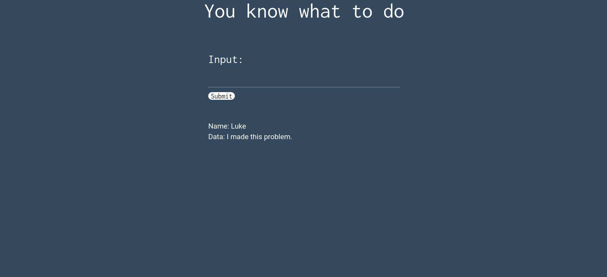

# Writeup for [Basic Injection](https://ctflearn.com/challenge/88) Box

We are prompted with a page that lets us submit some input...  




I have tried to provide some random input like "test" and tried some linux commands, but both returned nothing. So it is always good practice to see the source code of the website to figure out what is actually happening in the backend.  
We can see that we found some comments in the page source.  


I tried to use Luke and we got some output from the website.  


It seems that we have a database connected to the webserver, and we can potentially exploit that with SQL Injection.  
I usually like to try   

```
'OR 1=1 -- -
```  

This sql statement will return `TRUE` because 1=1 is true, and the
```
-- -
```
denotes to comment out the rest of the statement. When we input this statement to the website, it will dump the whole database.

  
We can see our flag right there on the output of the dumped database.
