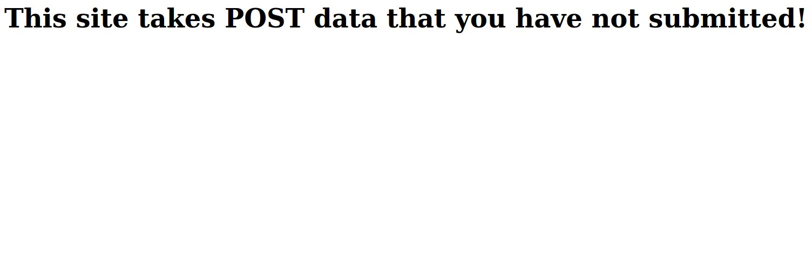
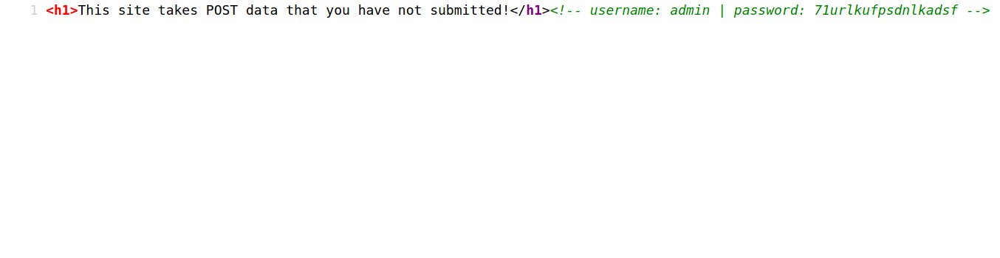

# Writeup for [POST Practice](https://ctflearn.com/challenge/114) Box

When we navigate to the giver url, we can see that we are required to submit a POST request to the website  

  
As always, I look at the source code of the page to see if I can get any hints on how this website is processed.
And we got some credentials from the html source as comments  
  
To make this POST request, I have chosen to utilize the curl command which is basically found on any Linux box.
```bash
curl -X POST -d 'username=admin&password=71urlkufpsdnlkadsf' http://165.227.106.113/post.php;echo
```

We would get our flag after running this command on the terminal.
