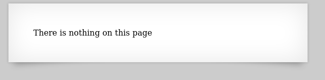
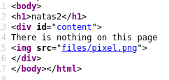

# Writeup for [Natas 2 - Natas 3](http://natas2.natas.labs.overthewire.org) from [OverTheWire](https://overthewire.org)

We are prompted with a page that says that it has nothing in it.

As always, let's inspect the source code of the page.

We see an `` tag with the source file `/files/pixel.png`. So there may be a `files` directory on this web server.

Navigate to this directory, and we see a `users.txt` file that contains the password for `natas3`.

