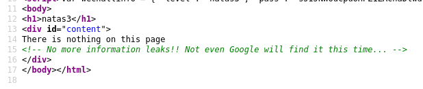
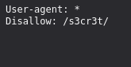
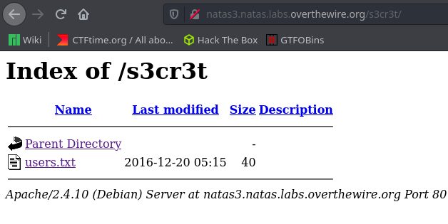

# Writeup for [Natas 3 - Natas 4](http://natas3.natas.labs.overthewire.org) from [OverTheWire](https://overthewire.org)

We are prompted with a page that says nothing, so as usual, we inspect the source code.

We see a comment that says `No more information leaks!! Not even Google will find it this time`.

This is a reference to the `robots.txt` file. This file tells web crawlers which pages to crawl and which pages not to crawl.

So navigating to `/robots.txt`, we can see a `/s3cr3t` directory is present on the webserver.

Navigating to that directory, we see another `users.txt` containing the password for the next level.

