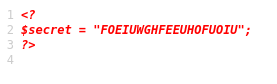
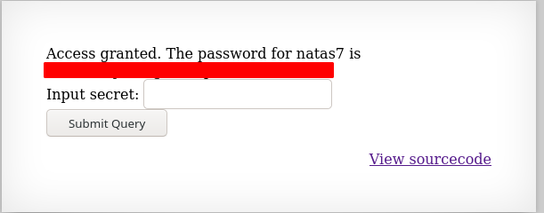

# Writeup for [Natas 6 - Natas 7](http://natas6.natas.labs.overthewire.org) from [OverTheWire](https://overthewire.org)

We are given a form to input a query. Let's try some random input like 'test'.

It tells us that it's the wrong secret.

After seeing this, let's try to review the source code.

Reading the source code, it looks like that it's including a file called `includes/secret.inc`. Let's try to navigate to that file in the webserver.

Navigate to `http://natas6.natas.labs.overthewire.org/includes/secret.inc`

We land on a blank page, but reading the source tells us the secret.

Now all we need to do is just input the secret we found to the query form from earlier.

