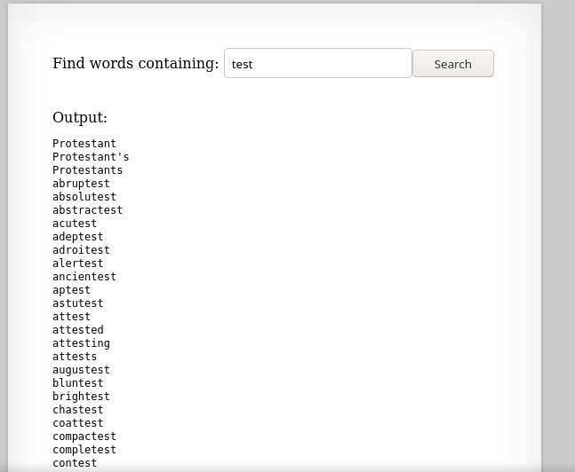
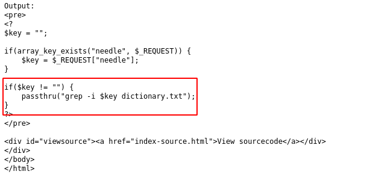
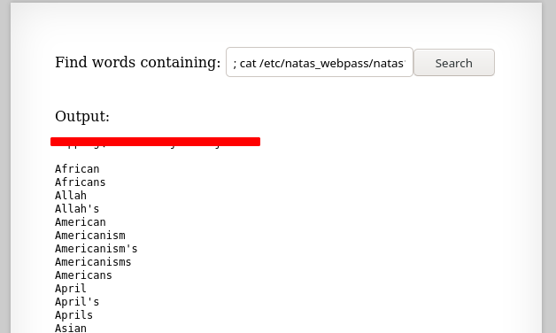

# Writeup for [Natas 9 - Natas 10](http://natas10.natas.labs.overthewire.org) from [OverTheWire](https://overthewire.org)

We see a page with a form, and if we give the input `test`, it spits out a bunch of words in which every word contains the word `test`.



Looking at the source code of this webapp, we see some interesting PHP.



Looks like that it's running `grep` on a file, but it appears that it's not sanitizing our input.

We can exploit this to inject our own malicous commands to do basically anything.

Our goal will be to read the password file for `natas10` which is located in `/etc/natas_webpass/natas10`.

```bash
; cat /etc/natas_webpass/natas10
```

The semicolon `;` in the beggining of the command will tell the bash shell to execute another set of commands after the first is ran.

So what our command will look like on the natas server will be something like this.

```bash
grep -i ; cat /etc/natas_webpass/natas10 dictionary.txt
```

Injecting our payload, we get the password as the first entry.


