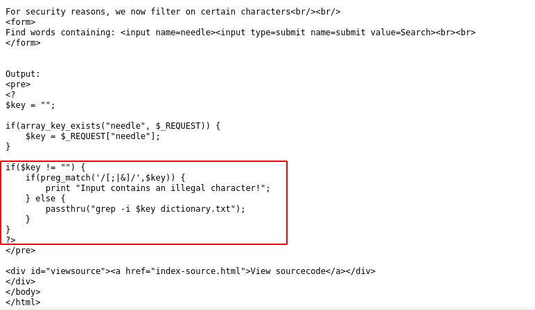
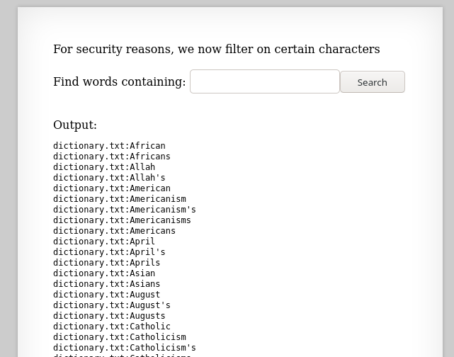
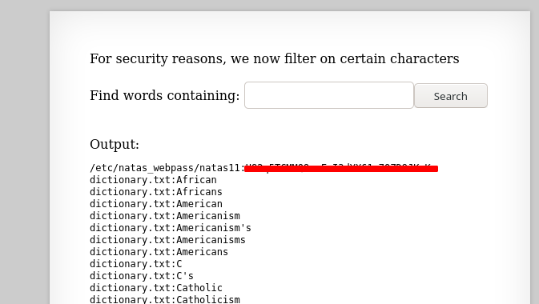

# Writeup for [Natas 10 - Natas 11](http://natas10.natas.labs.overthewire.org) from [OverTheWire](https://overthewire.org)

Looks like we're greeted with a similiar page from the previous challenge. But trying our previous payload didn't work, so let's dig in to the source code.



Looks like that there's some sanitizing going on here with the `preg_match` function in PHP.

The snippet `preg_match('/[;|&]/',$key` will match true to `;`, `|`, and `&`. So our previous payload is no good.

Remember that the snippet of code being ran is `grep -i $key dictionary.txt`.

We know from the previous levels that all the passwords are 32 characters long ranging from upper and lowercase alphabet and numeric values. So we can use the snippet being ran to grep a letter or number in the file that we want.

Let's try with the payload `'a' /etc/natas_webpass/natas11`, now our command will look something like this

```bash
# Command ran on the server
grep -i 'a' /etc/natas_webpass/natas11 dictionary.txt
```
This command will search for the letter 'a' in both `/etc/natas_webpass/natas11` and `dictionay.txt`, but using this payload doesn't give the password.



We know for sure that the command is being run successfully since we see output from `dictionary.txt`, so what's happening?

The only logical answer is that the password **does NOT** contain the letter 'a'. So we can just try to fuzz for other random letters or numbers, and we get the password once we hit the right one.


