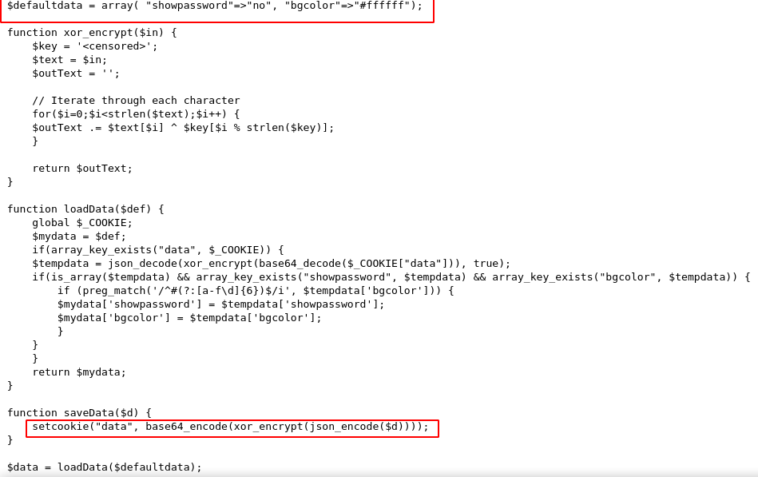
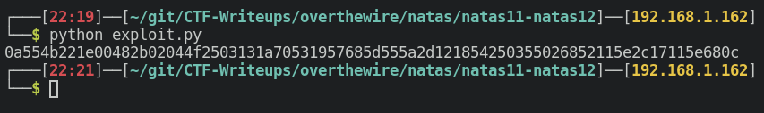
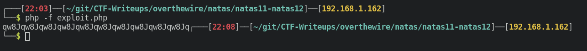
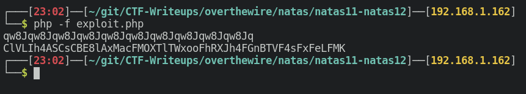
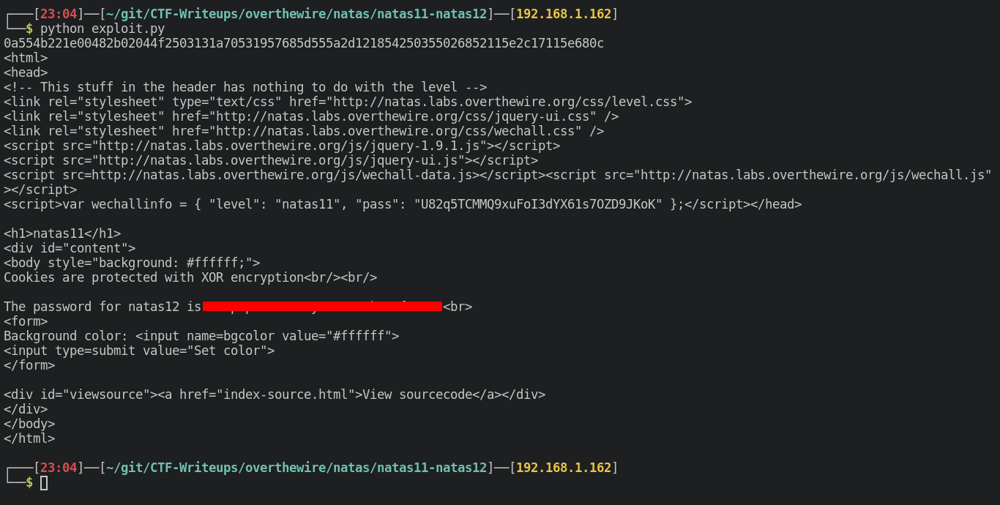

# Writeup for [Natas 11 - Natas 12](http://natas11.natas.labs.overthewire.org) from [OverTheWire](https://overthewire.org)

## Table Of Contents

<!-- MarkdownTOC -->

- [Retrieving The Cookie](#retrieving-the-cookie)
- [Source Code Analysis](#source-code-analysis)
- [Getting The Key](#getting-the-key)
- [Crafting The Malicous Cookie](#crafting-the-malicous-cookie)
- [Sending The Payload](#sending-the-payload)

<!-- /MarkdownTOC -->


Now we see a page that emphasizes that **Cookies are protected with XOR encryption**. We can assume there is probably something important with those cookies.

First of all, let's view the source code.



We see a bunch of interesting stuff here, we see that there is a `showpassword` field that is set to the default value of `no`. We can assume that if we set this field to `yes`, then we can potentially get the next user's password.

We also see that the cookie is set with a lot of processing like **base64 encoding, XORing, and JSON encoding**.

## Retrieving The Cookie

Let's create a python script to scrape out this cookie.

```python
#!/usr/bin/env python

import requests

from urllib.parse import unquote

import base64

url = 'http://natas11.natas.labs.overthewire.org'

user = 'natas11'

pw = '<REDACTED>'

# Do a GET request with proper authentication
r = requests.get(url,auth = ( user,pw ))

print(base64.b64decode(unquote(r.cookies['data'])).hex()) # View the raw cookie from the 'data' entry in hex

```

Running the script we get the raw base64 decoded cookie in hex.




## Source Code Analysis

Now that we got the cookie, let's try to understand how the PHP code works. I usually analyze code by ignoring all function until they are called.

That way I won't be overwhelmed with code that I don't understand.

So reading through the code, we can see the flow of the program.
1. If a cookie is set, it will decode it and set the 2 entries ( `showpassword` and `bgcolor`) to whatever the cookie is set to. If a cookie is not set, it will set the 2 entries with the **default values** which are `no` and `#ffffff`.
2. It is processing data with this order:
	1. JSON encode
	2. XOR
	3. Base64 encode

Now XOR has some unique properties where this "encryption" can be easily broken if we know 2 of the 3 elements.

Properties of XOR:
```
A ^ B = C
A ^ C = B
B ^ C = A
```

Now we do know 2 elements of the 3,which is the plaintext ( $defaultdata variable ) and the ciphertext ( which is the cookie ).

We can easily XOR these 2 elements and find the key, so then we can craft our own cookie with the `showpassword` entry set to `yes`.

## Getting The Key

Now let's use this XOR property to retrieve the key. First of all we need to understand that the cookie ( cipher text ) is a **base64 encoded** version of the raw XOR data. The input to the XOR is also **JSON encoded**.

We need to integrate this in our PHP code.

I also modified the PHP code to take 2 arguments instead of just one so we can easily manipulate the data being XOR'd.

```php
$defaultdata = array( "showpassword"=>"no", "bgcolor"=>"#ffffff");

function xor_encrypt($in,$key) {

    // XOR properties
    // plaintext ^ key = cipher
    // plaintext ^ cipher = key

    $key = $key;
    $text = $in;
    $outText = '';

    // Iterate through each character
    for($i=0;$i<strlen($text);$i++) {
    $outText .= $text[$i] ^ $key[$i % strlen($key)];
    }

    return $outText;
}

// Raw output of XOR function
$cipher_text = hex2bin("0a554b221e00482b02044f2503131a70531957685d555a2d121854250355026852115e2c17115e680c");

// Raw input of XOR function
$plain_text = json_encode($defaultdata);

echo xor_encrypt($plain_text,$cipher_text);

```

Running this script, we get something that repeats itself. This must be the key to this XOR function, `qw8J`.



## Crafting The Malicous Cookie

Now that we know the key, we just need to integrate it in our earlier PHP code.

```php
// Set showpassword to yes
$good_data = array( "showpassword"=>"yes", "bgcolor"=>"#ffffff");

$key = "qw8J";

$good_plain_text = json_encode($good_data);

$good_cipher_text = xor_encrypt($good_plain_text, $key);

$cookie = base64_encode($good_cipher_text);

echo $cookie;

echo "\n";

```

Running this code with the refactored `xor_encrypt` function, we should get a cookie.



## Sending The Payload

Now let's get back to our python script and add these few lines to the bottom.

We set the "data" cookie to our crafted cookie and do a GET request with that cookie.

```python
cookies = {
	"data" : "ClVLIh4ASCsCBE8lAxMacFMOXTlTWxooFhRXJh4FGnBTVF4sFxFeLFMK"
}


r = requests.get(url,auth = ( user,pw ) ,cookies=cookies)

print(r.text)
```

Running the script, we get the password for the next level.


