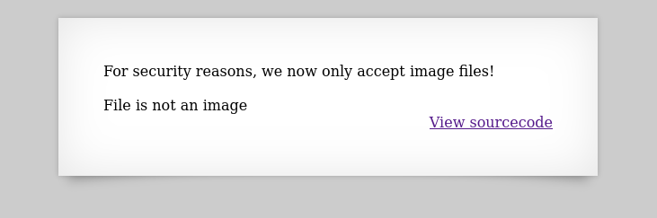
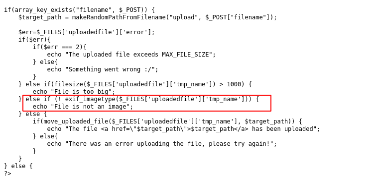
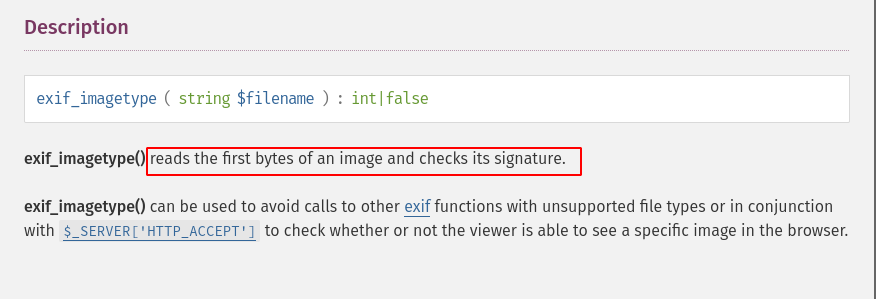
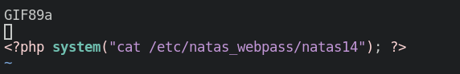
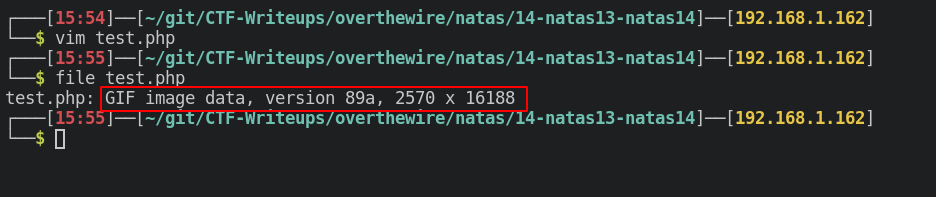
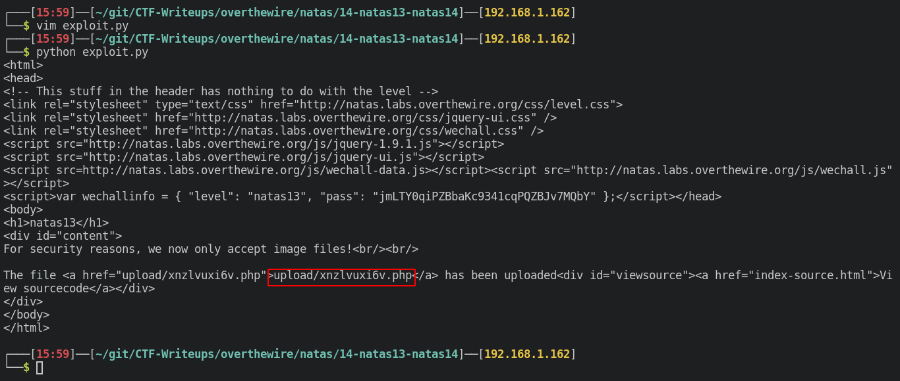
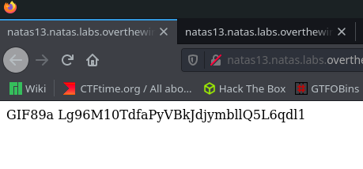

# Writeup for [Natas 13 - Natas 14](http://natas13.natas.labs.overthewire.org) from [OverTheWire](https://overthewire.org)

This challenge is similiar to the previous challenge, but it says that the webapp will only be accepting image files.

When we try to upload the `test.php` that we used in the previous challenge, it says that the file is not an image. Whereas the previous challenge just lets us upload the file.

Looking at the source code, we see that it is running the `exif_imagetype` function on the file.

Googling what this function does, we see that it will read the first few bytes of the file, and check it's signature. The first few bytes can determine what type of file this is. 

Now that we know it is reading the first few bytes of the file, often called ***Magic Bytes***, we can add a special signature to our `test.php` file and it should bypass this.

[This](https://en.wikipedia.org/wiki/List_of_file_signatures) is a list of file signatures that we can use to overwrite the first few bytes of a file.

I'm going to simply use a GIF type, since it is easiest to do. We just need to add `GIF89a` to the top of the file, and when we run the `file` command in bash, we should get that it is a GIF image file.

When we run the file command on it.

Now that we have a PHP file disguised as a GIF image file, let's use the python script from the previous challenge to once again upload our php file.

Make sure to change the `url` ,`user`, and `pw` variable to fit this specific level, and running it will give us the link.

Navigating to that file, we get the password for the next user.

