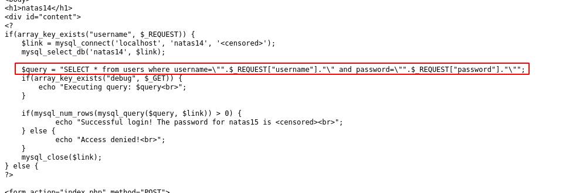
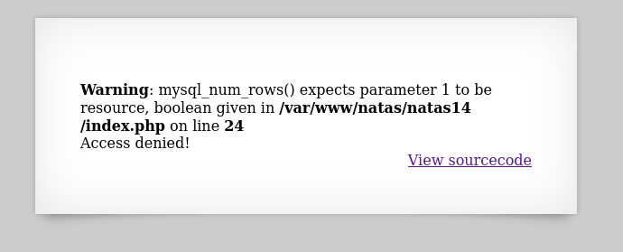
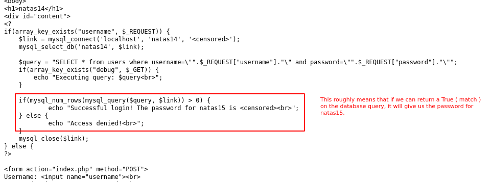
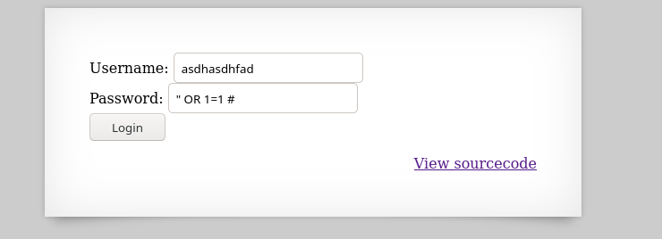
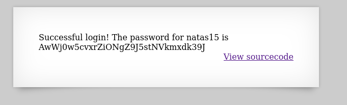

# Writeup for [Natas 14 - Natas 15](http://natas14.natas.labs.overthewire.org) from [OverTheWire](https://overthewire.org)


Looks like we are greeted with a login page. We could try some common weak credentials like `admin:admin` or `admin:password` but that doesn't seem to give us anything. It just tells us access denied.


Now, viewing the source code we see that the login page is hooked up to a database. The php code will query the database for a username and a password.

But, this block of code doesn't seem to sanitize any user input, it simply concatenates it to the given SQL Query. Meaning we can potentially input bad characters ( `#` , `"` , `'`,`%` , etc) that may cause unexpected behaviour.
> The `.` in PHP means concatenate.




The SQL query being ran should look something like this when we input `admin` as the username and `password` as the password.

```sql
SELECT * from users where username="admin" and password="password"
```
> This will attempt to query the database for **everything** ( the `*` symbol ) from the `users` table where the `username` column is equal to the string `"admin"` and the `password` column is equal to the string `"password"`.

Since the code simply concatenates the values, what would happen if we input `"` as the username or password? 

The query will look something like this if we input `"` as the username.

```sql
SELECT * from users where username=""" and password="password"
``` 

Notice how that there are now 3 quotation marks on the username field, where the first 2 is a complete string ( in this case an empty string ) but the third will start a new string that will end on the second to last quotation mark ( the string will contain the word ` and password=` ). Then it will leave the word `password"` as a query. This will cause the statement to error out.

In short, this SQL statement will interpret `username=""` as a query and will interpret `" and password="` as a string, and leave 1 extra quotation mark at the end right after the word `password` that is interpreted as a query.

This type of attack is called ***SQL Injection*** and this can cause a lot of damage since we can terminate queries and **inject** our own SQL code ( hence the name **SQL Injection** ). We can bypass logins, and even leak the entire database.


Trying this on the webpage ( I use a quotation mark on the username field and left the password to be `password`), we get an error message ( which is good because it means that we have potential ***SQL Injection*** )



Now to exploit this, we need to create a payload that will evaluate to `True` on the database query. We know this from reading the source code.



If you're familiar with programming, the statement `1=1` or `2=2` will always evaluate to `True`, this is also the case for SQL.

Since we want to get a `True` value from the query we can do an `OR` statement. And since we can terminate queries with ***SQL Injection*** by injecting a single quotation mark (`"`), we can potentially add a payload after that initial quotation mark that will be interpreted as SQL code on the database query.

This technique is often used to bypass login forms.

This is going to be the payload we'll be using for this challenge. It can be put in the `username` field or the `password` field, doesn't matter in this case.

```SQL
" OR 1=1 #
```

The beginning `"` will terminate the quotation mark that will leave the rest of the payload to be interpreted as code, the `OR 1=1` will evaluate to `True` since 1 is equal to 1, and the `#` at the end will comment out all remaining code.

The SQL query will look something like this

1. Payload in the `username` field
```sql
SELECT * from users where username="" OR 1=1 # and password="password"
``` 
2. Payload in the `password` field, we can set `username` field to anything in this case.
```sql
SELECT * from users where username="asdhfasdhf" and password="" OR 1=1 #
```

Trying this on the webpage, I'm going to use the payload on the `password` field.



We get the password for natas15.


