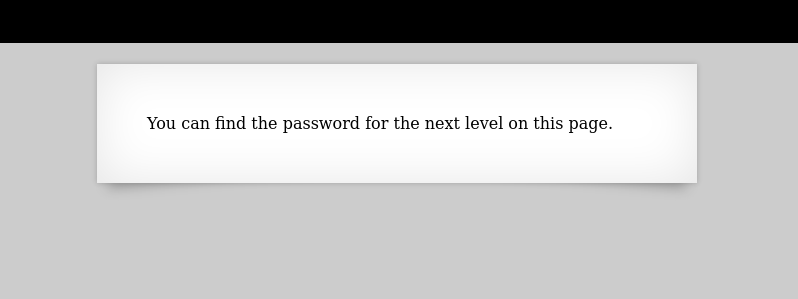
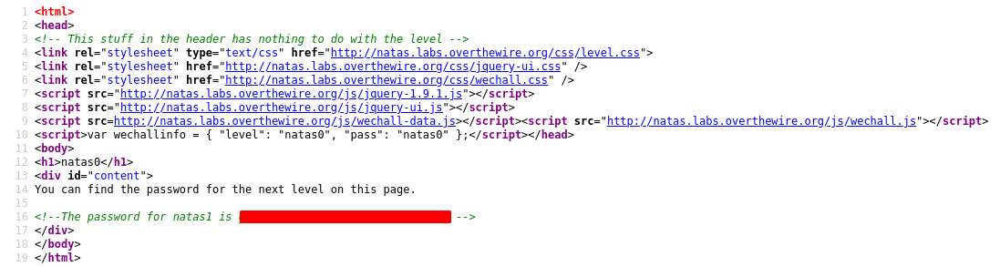

# Writeup for [Natas 0 - Natas 1](http://natas0.natas.labs.overthewire.org) from [OverTheWire](https://overthewire.org)

Let's login to the page with the username `natas0` and the default password of `natas0`

We are then prompted with a page that says that we can find the password for the next level in this page.

Looking at the page we don't see much, so let's check the source html of this page. 

We can do this by hitting `ctrl+u` on the keyboard or `right-click` the page and select `View Source`

We can the password in a comment at the bottom of the page.

