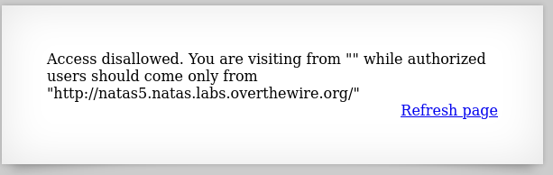
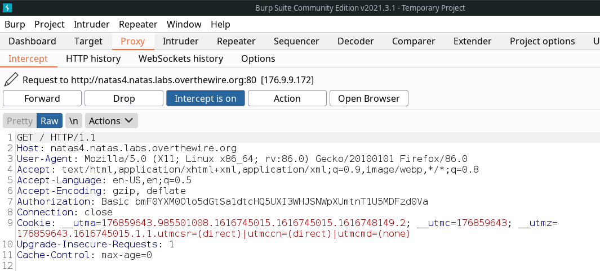
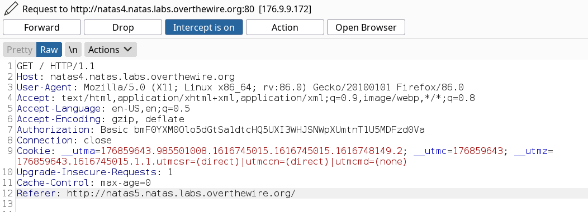
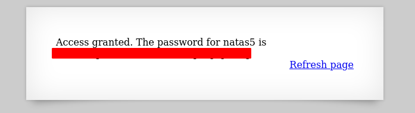

# Writeup for [Natas 4 - Natas 5](http://natas4.natas.labs.overthewire.org) from [OverTheWire](https://overthewire.org)

On the page, we see that we don't have access to this page.

To understand this problem, we need to do a little research on `HTTP Headers`. 

Everytime we send a request with the `HTTP` protocol, there is always an `HTTP Header` that sends some data to the server.

We can see this `HTTP Header` by intercepting the packet using a tool called [Burp Suite](https://portswigger.net/burp/communitydownload)

>Use [this](https://portswigger.net/burp/documentation/desktop/getting-started/proxy-setup/browser) link to setup burp suite on your browser

In burp, navigate to the `proxy` tab and make sure to set `Intercept` to on. After that reload the webpage and we should see that it will hang and keep loading. This means that burp has successfully intercepted the request.

This is what an `HTTP Header` roughly looks like.

The page did say that we were visiting the page from "" and authorized users should visit from `http://natas5.natas.labs.overthewire.org/`. We can edit the `HTTP Header` to include the `Referer` entry that tells the webserver where the request came from.

So let's add it to our `HTTP Header` and `Forward` the request.

After forwarding the request, let's turn `Intercept` off and visit the webpage. We can see that we got the password for the next level.

