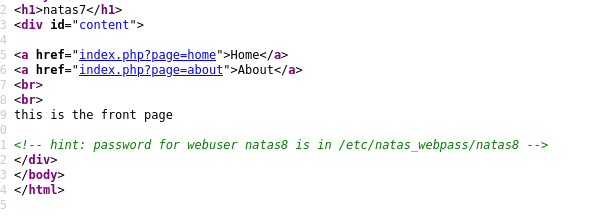
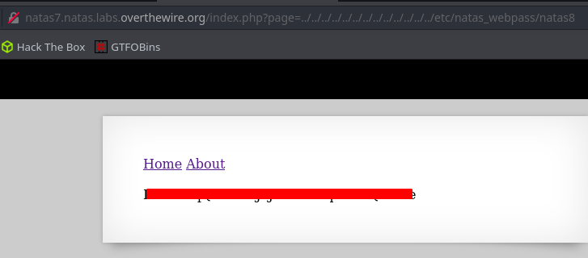

# Writeup for [Natas 7 - Natas 8](http://natas7.natas.labs.overthewire.org) from [OverTheWire](https://overthewire.org)

We are given a page with only 2 links. Clicking those links doesn't give us much info.

As usual, we're going to inspect the source code and we see a hint.



Looking closely, we see that those `href`s are navigating to those pages via the `GET` parameter `page=`. The fact that the hint is also pointing us to a file means that this webapp is probably vulnerable to [LFI](https://www.acunetix.com/blog/articles/local-file-inclusion-lfi/)

Let's try to access the password for natas8 using LFI. Just add a bunch `../` to traverse to the parent directory linear to the amount of `../` that we put. 

Meaning when we input `../../` we're going to traverse **2** directories up of the current directory.

You can add as much as you want as long that it's long enough to traverse to the `/` directory.

```bash
../../../../../../../../../../../../../../../etc/natas_webpass/natas8
```

```
http://natas7.natas.labs.overthewire.org/index.php?page=../../../../../../../../../../../../../../../etc/natas_webpass/natas8
```
Using the above as the url will give us the password for natas8.

