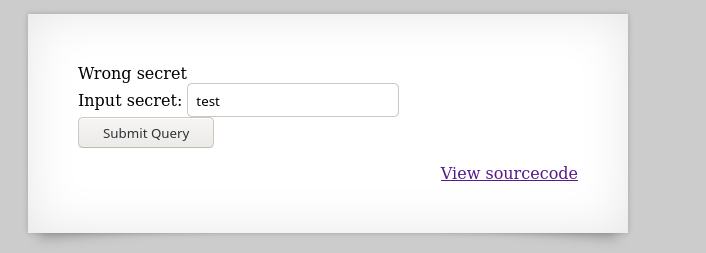
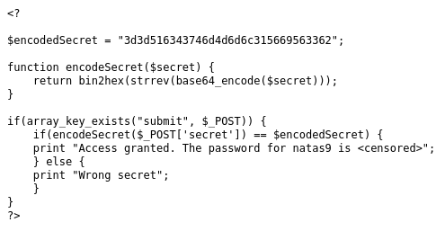
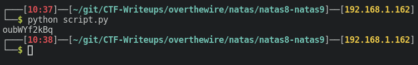
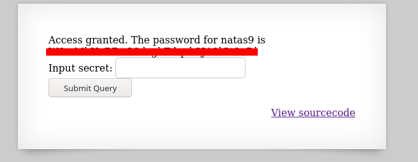

# Writeup for [Natas 8 - Natas 9](http://natas8.natas.labs.overthewire.org) from [OverTheWire](https://overthewire.org)

Again we are given a prompt to input a secret. As usual let's try some random input first.



Let's start reviewing the source code of this app.



Now this looks quite interesting. We are given an **encoded** secret and we are given functions that encode this secret.

We can simply just reverse the function and we should get a secret.

Let's write a quick script with Python.

Reading this encode function, we see that there are 3 functions in use.
1. base64_encode -> This must be to encode a string in base64
2. strrev -> I assume this means string reverse and it will reverse a string
3. bin2hex -> This converts an ascii string to it's hexadecimal equivalent

>We can always google these function if unsure of what it actually does.

The order of the functions is as follows;
1. Encode in base64
2. Reverse the string
3. Convert from string to hex

So we just need to reverse the process and write a script that will;
1. Convert from hex to ascii
2. Reverse the string
3. Decode the string from base64.


```python
#!/usr/bin/env python

import base64

encoded = '3d3d516343746d4d6d6c315669563362'

# Original Function -> bin2hex(strrev(base64_encode($secret)))

bytes_obj = bytes.fromhex(encoded) # Turn hex to bytes
ascii_string = bytes_obj.decode("ASCII") # Decode to ASCII from bytes

reversed_string = ascii_string[::-1] # Reverse the string

decoded_b64_string = base64.b64decode(reversed_string) # Decode from base64

print(decoded_b64_string.decode()) # Print the decoded string 
# .decode() in the end is so that the string doesn't start with the 'b' prefix

```
We then get the secret, and all we need to do is just input the secret to the webapp.



 